# Spring Boot
## RoadMap 


#### Spring Boot MVC and RESTful APIs
- [✅ What is a Bean?](#-what-is-a-bean)
- [🔄 Lifecycle of a Bean in Spring](#-lifecycle-of-a-bean-in-spring)
- [✅ What is Dependency Injection?](#-what-is-dependency-injection)
- [🧩 @ConditionalOnProperty in Spring Boot](#-conditionalonproperty-in-spring-boot)
- [📦 @SpringBootApplication in Spring Boot](#-springbootapplication-in-spring-boot)
- [🌐 How Does a Web Server Work in Spring Boot?](#how-does-a-web-server-work-in-spring-boot)
- [🎨 Presentation Layer & REST Annotations](#-presentation-layer--rest-annotations)
  - [📌 Core REST Annotations](#-core-rest-annotations)
  - [🔀 Request Mappings](#request-mappings)
  - [🌍 Dynamic URLs Paths](#dynamic-urls-paths)
  - [📩 RequestBody](#requestbody)
- [🗄️ Persistence Layer & JPA](#-persistence-layer--jpa)
- [⚙️ Service Layer & Business Logic](#--service-layer--business-logic)
  - [📁 Repository Integration](#-repository-layer)
  - [🔄 DTO Conversion with ModelMapper](#-modelmapper--entity--dto)
  - [🧪 ReflectionUtils ](#-reflectionutils--reflectiontestutils)
- [✅ Input Validation in Spring Boot](#-input-validation-in-spring-boot)
  - [📦 1 Dependency: spring-boot-starter-validation](#-1-dependency-spring-boot-starter-validation)
  - [🧩 2 Common Validation Annotations](#-2-common-validation-annotations)
  - [📥 3. Validating Request Body](#-3-validating-request-body)
  - [🧪 4. Custom Validation](#-4-custom-validation)
- [🌐 Exception Handling in Spring Boot](#-exception-handling-in-spring-boot)
  - [Local Exception Handling (@ExceptionHandler inside controller)](#-1-local-exception-handling-exceptionhandler-inside-controller)
  - [Global Exception Handling (@RestControllerAdvice)](#-2-global-exception-handling-restcontrolleradvice)
- [📒 ResponseBodyAdvice in Spring Boot](#-responsebodyadvice-in-spring-boot)
  - [Benefits](#-benefits)
- [🧩 Full Example: Unified API Response (Success + Error)](#-full-example-unified-api-responses-with-responsebodyadvice)
  - [1️⃣ DTO Class](#1-dto-class)
  - [2️⃣ ApiResponse Wrapper](#2-apiresponse-wrapper)
  - [3️⃣ ErrorDetail Class](#3-errordetail-class)
  - [4️⃣ ErrorCode Enum](#4-errorcode-enum)
  - [5️⃣ GlobalExceptionHandler](#5-globalexceptionhandler)
  - [6️⃣ ResponseBodyAdvice Wrapper](#6-responsebodyadvice-wrapper)
  - [7️⃣ Controller Example](#7-controller-example)
  - [8️⃣ Example Outputs](#8-example-outputs)
 ###  Hibernate
- [Hibernate and JPA](#hibernate-and-jpa)
  - [JPA (Java Persistence API)](#jpa-java-persistence-api)
  - [Common Hibernate Configurations](#common-hibernate-configurations)
  - [Entity Annotation](#entity-annotation)
  - [Key features of JPA](#key-features-of-jpa)
- [Spring Data JPA & Dynamic Query Methods](#spring-data-jpa--dynamic-query-methods)
  - [What is Spring Data JPA?](#1-what-is-spring-data-jpa)
  - [Dynamic Query By Methods](#1-dynamic-query-methods)
  - [@Query Annotation](#2-query-annotation)
- [Sorting and Pagination in Spring Data Jpa](#sorting-and-pagination-in-spring-data-jpa)
  - [Sorting with method queries](#1-sorting-with-method-queries)
  - [2. Sorting with the Sort class](#2-sorting-with-the-sort-class)
  - [Pagination](#pagination)
- [Projection in Spring Data JPA](#projection-in-spring-data-jpa)
  - [1. Default (Entity) Fetch](#1-default-entity-fetch-)
  - [2. Interface-based Projection](#2-interface-based-projection)
  - [3. Class-based (DTO) Projection](#3-class-based-dto-projection)
  - [4. Dynamic Projection](#4-dynamic-projection)
- [🔄 Hibernate Entity Lifecycle States](#-hibernate-entity-lifecycle-states)
- [🔗 Relationships in JPA](#-relationships-in-jpa)
- [🔄 Cascading in JPA and @Transactional](#-cascading-in-jpa-and-transactional)
- [🔄 Infinite Loop Problem (Serialization)](#-infinite-loop-problem-serialization)

### Production ready Spring Boot Features
- [Spring Boot DevTools]()
- [Audting]()
- [Making Third party API calls](#making-third-party-api-calls-with-restclient)
  - [RestClient](#Building-RestClient)
    - []()
  - [WebCient (WebFlux)]()
- [Logging](#logging)

### 🛡️ Spring Security
- [Cross-Site Request Forgery](#cross-site-request-forgery-csrf)
- [Adding Spring Security](#adding-spring-security)
- [Authentication and Authorization](#authentication-and-authorization)
- [Internal working of Spring Security](#internal-working-of-spring-security)
  - [Default behaviour of Spring-Security](#default-behaviour-of-spring-security)
- [Core Spring Security Components](#core-spring-security-components)
- [⭐ SPRING SECURITY FULL FLOW](#-spring-security-full-flow)
  - [1️⃣ When a request comes to the server](#1-when-a-request-comes-to-the-server)
  - [2️⃣ Spring Security Filter Chain begins](#2-spring-security-filter-chain-begins)
  - [3️⃣ Authentication happens inside the filter chain](#3-authentication-happens-inside-the-filter-chain)
  - [4️⃣ AuthenticationManager (CORE)](#4-authenticationmanager-core)
  - [5️⃣ AuthenticationProvider (DECIDES AUTH)](#5-authenticationprovider-decides-auth)
  - [6️⃣ UserDetailsService](#6-userdetailsservice)
  - [7️⃣ PasswordEncoder](#7-passwordencoder)
  - [8️⃣ After authentication → SecurityContext is filled](#8-after-authentication--securitycontext-is-filled)
  - [9️⃣ Authorization (URL access check)](#9-authorization-url-access-check)
- [Default SecurityFilterChain Config](#default-securityfilterchain-config)
- [Understanding JWT](#understanding-jwt)
  - [Why use JSON Web Token (JWT)](#why-use-json-web-token-jwt)
  - [JSON Web Token (JWT)](#json-web-token-jwt)
  - [JWT Dependencies](#jwt-dependencies)
- [Creation and Verification of JWT](#creation-and-verification-of-jwt)
  - [create and login](#create-and-login-)
  - [Authenticating requests using JWT](#authenticating-requests-using-jwt)
- [Testing](#understanding-junit-and-assertj)
  - [Common Junit Annotations](#common-junit-annotations)
  - [JUnit vs AssertJ](#junit-vs-assertj)
    - [Common AssertJ Methods](#common-assertj-methods)
  - [Unit Testing vs Integration Testing](#unit-testing-vs-integration-testing)
  - [Key Testing Annotations in Spring Boot](#key-testing-annotations-in-spring-boot)
  - 


### ✅ What is a Bean?

A Bean in Spring is a Java object that is managed by the Spring IoC (Inversion of Control) container. It is created, configured, and wired by Spring.

### 🧪 How to Define a Bean?
1. Using @Component (Most Common)

```java
@Component
public class MyService {
    public void serve() {
        System.out.println("Service is running...");
    }
}
```
📌 Make sure to enable component scanning using @ComponentScan (optional in Spring Boot).

2. Using @Bean in a @Configuration class
```java
@Configuration
public class AppConfig {
    @Bean
    public MyService myService() {
        return new MyService();
    }
}
```
3. Using XML (Old Style)
```
<bean id="myService" class="com.example.MyService"/>
 ```
🔍 Common Stereotype Annotations

| Annotation                     |            Usage            |       
|:-------------------------------|:---------------------------:|
| @Component                     |   **Generic Spring Bean**   | 
| @Service                       |    `Service layer logic`    |  
| @Repository                    |    _DAO/Database layer_     |  
| @Controller                    |  _Web layer (Spring MVC)_   | 
| RestController                 |    _Web API controller_     | 

### 📌 Summary

Spring manages beans for dependency injection and configuration.

You can create beans using @Component, @Bean, or XML.

Spring Boot auto-scans and registers components in the same or child packages.

## 🔄 Lifecycle of a Bean in Spring

✅ What is Bean Lifecycle?

The Bean Lifecycle is the complete process from creation to destruction of a bean, managed by the Spring IoC container.

### 🔁 Lifecycle Phases

| Phase                              |                                            Description                                             |       
|:-----------------------------------|:--------------------------------------------------------------------------------------------------:|
| 1️⃣ Instantiation                  |                      **Bean object is created (via constructor or factory).**                      | 
| 2️⃣ Dependency Injection           |                        `Spring injects dependencies using @Autowired, etc.`                        |  
| 3️⃣ Aware Interfaces               | _If the bean implements BeanNameAware, ApplicationContextAware, etc., Spring calls those methods._ |  
| 4️⃣ Pre-initialization             |                       _Any logic inside BeanPostProcessor before init runs._                       | 
| 5️⃣ Initialization                 |            _Calls methods like @PostConstruct, afterPropertiesSet() (if implemented)._             | 
| 6️⃣ Post-initialization            |                          _BeanPostProcessor logic after init completes._                           | 
| 7️⃣ Ready to Use                   |                              _Bean is fully initialized and in use._                               | 
| 8️⃣ Destruction                    |                  _When container shuts down, calls @PreDestroy, destroy(), etc._                   | 

🧪 Example

```java
@Component
public class MyBean implements InitializingBean, DisposableBean {

    @PostConstruct
    public void initMethod() {
        System.out.println("Bean is initialized - @PostConstruct");
    }

    @Override
    public void afterPropertiesSet() {
        System.out.println("Bean is initialized - afterPropertiesSet");
    }

    @PreDestroy
    public void cleanup() {
        System.out.println("Bean is being destroyed - @PreDestroy");
    }

    @Override
    public void destroy() {
        System.out.println("Bean is being destroyed - destroy()");
    }
}

```
💡 Note

In Spring Boot, destruction methods like @PreDestroy only work for singleton-scoped beans by default.

Lifecycle methods are helpful for initializing resources (e.g., DB connections) or cleanup (e.g., closing connections).

### ✅ What is Dependency Injection?

Dependency Injection (DI) is a design pattern where one object supplies the dependencies (objects it needs) of another object.

In Spring, DI allows Spring to manage and inject the required objects (beans) automatically, so you don’t need to manually create them using new.

🧪 Example Without DI
```java
public class Car {
    Engine engine = new Engine(); // Tightly coupled
}
```
🧪 Example With DI (Using Spring)
```java
@Component
public class Engine { }

@Component
public class Car {
    private final Engine engine;

    @Autowired
    public Car(Engine engine) {
        this.engine = engine;
    }
}
```
Spring will automatically inject the Engine bean into Car.

### 💡 Types of Dependency Injection in Spring

| Type                  | How it Works                                                        |
|-----------------------|---------------------------------------------------------------------|
| Constructor Injection | Dependencies are passed through the constructor (**Recommended**)   |
| Setter Injection      | Dependencies are set using setter methods                           |
| Field Injection       | Dependencies are injected directly into fields (**Less preferred**) |

✅ Constructor Injection (Best Practice)

```java
@Component
public class Car {
    private final Engine engine;

    @Autowired
    public Car(Engine engine) {
        this.engine = engine;
    }
}
```
⚠️ When You Should Use @Autowired
- If the class has multiple constructors, and you want to tell Spring which one to use.
- 
- For setter or field injection, @Autowired is still required.

📌 Final Tip
For clean code, it's best to:
- Use constructor injection without @Autowired when you have only one constructor.
- Keep your beans as final, which works well with constructor injection.

✅ Setter Injection
```java
@Component
public class Car {
    private Engine engine;

    @Autowired
    public void setEngine(Engine engine) {
        this.engine = engine;
    }
}
```
✅ Field Injection (Not Recommended)
```java
@Component
public class Car {

    @Autowired
    private Engine engine;
}
```
🧠 Why Use DI?
- Loose coupling between classes
- asier to test (can mock dependencies)
- Managed by Spring, not manually created
- Cleaner, maintainable code

## 🧩 @ConditionalOnProperty in Spring Boot

### ✅ What is @ConditionalOnProperty?
@ConditionalOnProperty is a Spring Boot conditional annotation used to enable or disable a bean based on a value in the application.properties or application.yml file.

### 📌 Use Case:

It helps you control whether a specific configuration or bean should be loaded, depending on a specific property value

### 🧪 Example
✅ Step 1: Add property in application.properties
```
my.feature.enabled=true
```
✅ Step 2: Use @ConditionalOnProperty in your config
```java
@Configuration
public class FeatureConfig {

    @Bean
    @ConditionalOnProperty(
        name = "my.feature.enabled",
        havingValue = "true",
        matchIfMissing = false // optional
    )
    public MyFeatureBean myFeatureBean() {
        return new MyFeatureBean();
    }
}
```
🟢 This bean will only be created if my.feature.enabled=true is present in properties.

### ⚙️ Key Parameters

| Parameter        | Description                                                                         |
|------------------|-------------------------------------------------------------------------------------|
| `name`           | The property name to check (e.g. `"my.feature.enabled"`)                            |
| `havingValue`    | The expected value to match (e.g. `"true"`)                                         |
| `matchIfMissing` | If `true`, bean will be created even if the property is missing. Default is `false` |

💡 Real-World Example
Useful for:
- Feature toggles
- Dev vs Prod environments
- Optional modules (like enabling a specific datasource or scheduler)

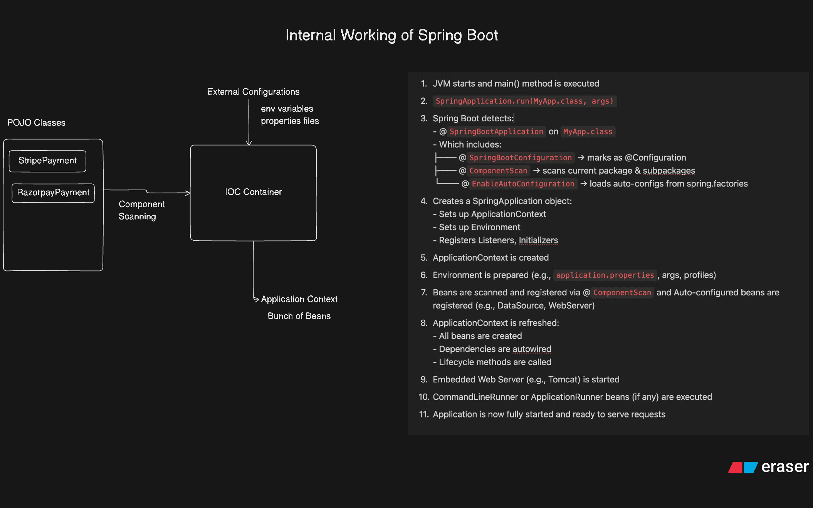


## 📦 @SpringBootApplication in Spring Boot

@SpringBootApplication is a meta-annotation in Spring Boot.

It bundles three important annotations:

### 1️⃣ @Configuration
- Marks the class as a source of bean definitions for the Spring IoC container.
- You can define @Bean methods here.

### 2️⃣ @EnableAutoConfiguration
- Tells Spring Boot to enable auto-configuration.
- It looks at the classpath, existing beans, and properties to configure the application automatically.
- Driven by spring.factories and META-INF.

### 3️⃣ @ComponentScan
- Scans the package and its sub-packages for Spring-managed components (@Component, @Service, @Repository, @Controller, etc.).
- Without this, Spring wouldn’t find your beans automatically.

### 🧠 Why bundle them?
Instead of writing:
```java
@Configuration
@EnableAutoConfiguration
@ComponentScan
public class MyApp { }

```
You just write:
```java
@SpringBootApplication
public class MyApp {
    public static void main(String[] args) {
        SpringApplication.run(MyApp.class, args);
    }
}
```
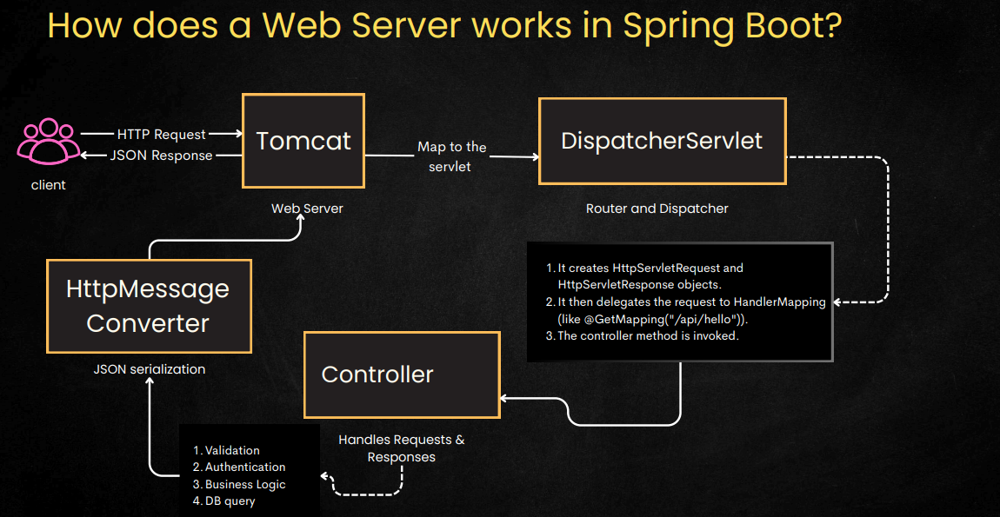

## How Does a Web Server Work in Spring Boot?
1. Client Request
   - The client sends an HTTP request (e.g., GET/POST) to the server.
   - The server responds with JSON data.

2. Tomcat (Embedded Web Server)
   - Tomcat receives the HTTP request.
   - It maps the request to the appropriate Servlet (in Spring Boot, it's usually DispatcherServlet).

3. DispatcherServlet (Router & Dispatcher)

    - Creates HttpServletRequest and HttpServletResponse objects.
    - Delegates the request to HandlerMapping (e.g., @GetMapping("/api/hello")).
    - Invokes the corresponding Controller method.
4. Controller
   - Handles the request and processes the business logic:
     - Validation
     - Authentication 
     - Business Logic 
     - Database Queries 
     - Returns a Java object or response data.
5. HttpMessageConverter
    - Converts the Java object to JSON (serialization) for the HTTP response.
6. Response to Client
   - The JSON response is sent back to the client via Tomcat.

# 🎨 Presentation Layer & REST Annotations

## 🖥 What is the Presentation Layer ?

The Presentation Layer is the part of your app that handles user interaction — either through web pages or APIs.

It takes requests ➡ sends them to the right business logic ➡ sends responses back.

💡 Think: Hotel receptionist — your first point of contact


Spring MVC provides an annotation-based programming model where
@Controller and @RestController components use annotations to express
request mappings, request input, exception handling, and more.


## 📌 Core REST Annotations

| Annotation        | Purpose / Usage                                                                          | Example                                                     |
|-------------------|------------------------------------------------------------------------------------------|-------------------------------------------------------------|
| `@RestController` | Combines `@Controller` and `@ResponseBody` — returns data (JSON/XML) directly, no views. | `@RestController public class MyApi {}`                     |
| `@ResponseBody`   | Places the return value directly into the HTTP response body. Used in REST APIs.         | `@GetMapping("/hi") public String hi() { return "Hello"; }` |
| `@RequestMapping` | Maps HTTP requests (any method) to handler methods; used at class or method level.       | `@RequestMapping("/users")`                                 |
| `@GetMapping`     | Handles HTTP GET requests (read data).                                                   | `@GetMapping("/users")`                                     |
| `@PostMapping`    | Handles HTTP POST requests (create data).                                                | `@PostMapping("/users")`                                    |
| `@PutMapping`     | Handles HTTP PUT requests (full update of a resource).                                   | `@PutMapping("/users/{id}")`                                |
| `@DeleteMapping`  | Handles HTTP DELETE requests (remove resource).                                          | `@DeleteMapping("/users/{id}")`                             |
| `@PatchMapping`   | Handles HTTP PATCH requests (partial update of a resource).                              | `@PatchMapping("/users/{id}")`                              |
| DTO               | **Data Transfer Object** — carries data between layers without exposing entities.        | `UserDTO { name, email }`                                   |
| `@PathVariable`   | Extracts values from URL path segments.                                                  | `/users/101` → `@PathVariable int id`                       |
| `@RequestParam`   | Extracts query parameters from URL.                                                      | `/users?sort=asc` → `@RequestParam String sort`             |
| `@RequestBody`    | Maps JSON/XML request body to a Java object.                                             | `@PostMapping UserDTO user`                                 |

## Request Mappings

You can use the @RequestMapping annotation to map requests to
controllers methods. It has various attributes to match by URL, HTTP
method, request parameters, headers, and media types.

There are also HTTP method specific shortcut variants of
@RequestMapping:

- @GetMapping
- @PostMapping
- @PutMapping
- @DeleteMapping
- @PatchMapping

## Dynamic URLs Paths

| @PathVariable                                                                                          | @RequestParam                                                                                                              |
|--------------------------------------------------------------------------------------------------------|----------------------------------------------------------------------------------------------------------------------------|
| `/employees/123`                                                                                       | /employees?id=123                                                                                                          |
| Use path variables when the parameter is an essential part of the URL path that identifies a resource. | Use query parameters when the parameter is optional and usedfor filtering, sorting, or other modifications to the request. |

## RequestBody

@RequestBody is used to bind the HTTP request body to a Java object.
When a client sends data in the body of a request (e.g., JSON or XML),
@RequestBody maps this data to a Java object.

Use Case:

- Typically used in POST, PUT, and PATCH methods where the client
sends data that needs to be processed by the server.
-  Converts JSON or XML data from the request body into a Java object
using a message converter (e.g., Jackson for JSON).

### 🛠 Example

````java
@RestController
@RequestMapping("/users")
public class UserController {

    @GetMapping("/{id}")
    public String getUser(@PathVariable int id) {
        return "User ID: " + id;
    }

    @GetMapping
    public String getUsers(@RequestParam(defaultValue = "asc") String sort) {
        return "Sorting: " + sort;
    }

    @PostMapping
    public String createUser(@RequestBody UserDTO user) {
        return "Created user: " + user.getName();
    }

    @PutMapping("/{id}")
    public String updateUser(@PathVariable int id, @RequestBody UserDTO user) {
        return "Updated user " + id + " to name: " + user.getName();
    }

    @PatchMapping("/{id}")
    public String partiallyUpdateUser(@PathVariable int id, @RequestBody Map<String, Object> updates) {
        return "Partial update for " + id + ": " + updates;
    }

    @DeleteMapping("/{id}")
    public String deleteUser(@PathVariable int id) {
        return "Deleted user " + id;
    }
}
````

✅ Best Practices
- Keep controllers slim — push logic to Service layer.
- Use DTOs instead of exposing entity models.
- Validate inputs with @Valid and error handling.
- Stick to RESTful naming: /users, /users/{id}, /users?filter=value.


## 🗄️ Persistence Layer & JPA

### 📦 What is the Persistence Layer?

The Persistence Layer is responsible for storing, retrieving, and managing data in your application.

It interacts with the database using tools like JPA (Java Persistence API) and ORM frameworks like Hibernate.

##### 💡 Think of it as the warehouse of your app — where all the data lives and gets organized.

### 🔧 Key Component

## 🔧 Key Components – Persistence Layer

| Component        | Role                                                                        |
|------------------|-----------------------------------------------------------------------------|
| **JPA**          | Specification for ORM in Java. Defines how Java objects map to DB tables.   |
| **Entity**       | A Java class annotated with `@Entity` that represents a DB table.           |
| **Repository**   | Interface that provides CRUD operations using Spring Data JPA.              |
| **JPA Provider** | Implementation of JPA (e.g., Hibernate) that handles actual DB interaction. |

🧱 Entity Example

```java
@Entity
@Table(name = "users")
public class User {

    @Id
    @GeneratedValue(strategy = GenerationType.IDENTITY)
    private Long id;

    private String name;
    private String email;

    // Getters and setters
}
```
- @Entity → Marks this class as a DB table.
- @Id → Primary key.
- @GeneratedValue → Auto-generates ID.
- @Table(name = "users") → Optional: maps to specific table name

### 📁 Repository Example
```java
public interface UserRepository extends JpaRepository<User, Long> {
    // Custom query methods
    List<User> findByName(String name);
}
```
- JpaRepository<Entity, ID> → Gives you CRUD methods out of the box.
- You can define custom queries like findByEmail, findByNameContaining, etc

🔄 How It All Connects
```text
Controller → Service → Repository → Database
```
- Controller handles user/API requests.
- Service contains business logic.
- Repository interacts with the database using JPA.

✅ Best Practices
- Keep entities clean — no business logic.
- Use DTOs to transfer data between layers.
- Prefer constructor-based injection in services.
- Use Spring Data JPA for rapid development — it handles most boilerplate.


## ⚙️ ⚙️ Service Layer & Business Logic

### 🧩 What is the Service Layer

The Service Layer contains your business logic — it’s the brain of your application.
It sits between the Controller (which handles requests) and the Repository (which talks to the database).

💡 Think of it as the operations team: the controller says “do this,” and the service figures out how

```java
@Service
public class UserService {

    @Autowired
    private UserRepository userRepository;

    public UserDTO getUserById(Long id) {
        User user = userRepository.findById(id).orElseThrow();
        return modelMapper.map(user, UserDTO.class);
    }
}
```
- Annotated with @Service
- Calls repository methods
- Returns DTOs or domain objects
### 📁 Repository Layer

The Repository Layer interacts directly with the database using Spring Data JPA.
```java
public interface UserRepository extends JpaRepository<User, Long> {
    List<User> findByName(String name);
}
```
- Extends JpaRepository<Entity, ID>
- Auto-generates CRUD methods
- Supports custom queries like findByEmail, findByAgeGreaterThan

### 📦 ResponseEntity

Used in the Controller Layer to return structured HTTP responses.
```java
@GetMapping("/{id}")
public ResponseEntity<UserDTO> getUser(@PathVariable Long id) {
    UserDTO user = userService.getUserById(id);
    return ResponseEntity.ok(user);
}
```
- Controls status code, headers, and body
- Common patterns: ok(), status(), noContent(), created()

### 🔄 ModelMapper – Entity ↔ DTO
ModelMapper is a library that automatically maps between objects (e.g., Entity ↔ DTO).

```java
@Autowired
private ModelMapper modelMapper;

UserDTO dto = modelMapper.map(user, UserDTO.class);
User user = modelMapper.map(dto, User.class);
```
- Reduces boilerplate mapping code
- Can be customized for nested or mismatched fields
- Add to your config

```java
@Bean
public ModelMapper modelMapper() {
    return new ModelMapper();
}
```

### 🧪 ReflectionUtils / ReflectionTestUtils
Used in unit testing to access or modify private fields/methods.
```text
User user = new User();
ReflectionTestUtils.setField(user, "email", "test@example.com");

String result = ReflectionTestUtils.invokeMethod(user, "privateMethodName");
```
- Useful for testing classes with private fields/methods
- Can inject mocks into private fields
- Part of spring-test module

✅ Best Practices
- Keep Service Layer focused on logic, not HTTP.
- Use DTOs to isolate domain models from API contracts.
- Let Controller handle ResponseEntity, not Service.
- Use ModelMapper for clean object conversion.
- Use ReflectionTestUtils only in tests — not in production code.

## ✅ Input Validation in Spring Boot

### 📦 1. Dependency: spring-boot-starter-validation
Add this to your pom.xml to enable Bean Validation using Hibernate Validator:
```xml
<dependency>
  <groupId>org.springframework.boot</groupId>
  <artifactId>spring-boot-starter-validation</artifactId>
</dependency>
```
- Automatically integrates with Spring Boot
- Enables annotations like @NotNull, @Size, @Email, etc.
- Works with @Valid and @Validated in controllers an

### 🧩 2. Common Validation Annotations

| 🏷️ Annotation  | 📌 Purpose                                  | 🧪 Example Usage                      |
|-----------------|---------------------------------------------|---------------------------------------|
| `@NotNull`      | Field must not be `null`                    | `@NotNull private String name;`       |
| `@NotBlank`     | Must not be empty or whitespace             | `@NotBlank private String username;`  |
| `@NotEmpty`     | Must not be empty (for collections/strings) | `@NotEmpty List<String> tags;`        |
| `@Size`         | Length or size constraints                  | `@Size(min=2, max=30)`                |
| `@Email`        | Valid email format                          | `@Email private String email;`        |
| `@Min` / `@Max` | Numeric range                               | `@Min(18) @Max(99)`                   |
| `@Pattern`      | Regex match                                 | `@Pattern(regexp="\\d{10}")`          |
| `@Positive`     | Must be > 0                                 | `@Positive private int quantity;`     |
| `@Negative`     | Must be < 0                                 | `@Negative private int offset;`       |
| `@AssertTrue`   | Must be `true`                              | `@AssertTrue private boolean agreed;` |
| `@AssertFalse`  | Must be `false`                             | `@AssertFalse private boolean error;` |
| `@Future`       | Date must be in the future                  | `@Future private LocalDate expiry;`   |
| `@Past`         | Date must be in the past                    | `@Past private LocalDate dob;`        |

Use these in DTOs or request models to enforce field-level constraints.


### 📥 3. Validating Request Body
```java
@PostMapping("/register")
public ResponseEntity<?> registerUser(@Valid @RequestBody UserDTO user) {
    // If validation fails, Spring auto-returns 400 Bad Request
    return ResponseEntity.ok("User registered");
}
```
- @Valid triggers validation on incoming request body
- Errors are handled automatically unless overridden

### 🧪 4. Custom Validation
✅ Step 1: Create Custom Annotation
```java
@Documented
@Constraint(validatedBy = IpAddressValidator.class)
@Target({ ElementType.FIELD })
@Retention(RetentionPolicy.RUNTIME)
public @interface ValidIp {
    String message() default "Invalid IP address";
    Class<?>[] groups() default {};
    Class<? extends Payload>[] payload() default {};
}
```
✅ Step 2: Create Validator Class
```java
public class IpAddressValidator implements ConstraintValidator<ValidIp, String> {
    @Override
    public boolean isValid(String ip, ConstraintValidatorContext context) {
        return ip != null && ip.matches("^(\\d{1,3}\\.){3}\\d{1,3}$");
    }
}
```
✅ Step 3: Apply in DTO
```java
public class DeviceDTO {
    @ValidIp
    private String ipAddress;
}
```
### 🧠 5. `@Validated` vs `@Valid`

| 🏷️ Annotation | 🔍 Scope / Target                     | ⚙️ Use Case / Behavior                                                     |
|----------------|---------------------------------------|----------------------------------------------------------------------------|
| `@Valid`       | Method parameters, fields             | Triggers validation on request bodies, nested objects, and fields in DTOs  |
| `@Validated`   | Class-level (e.g., on service)        | Enables method-level validation and supports validation groups             |
|                |                                       | Required for validating method parameters in service or controller methods |
| ✅ Key Point    | `@Valid` is simpler and field-focused | `@Validated` is more flexible and supports advanced scenarios like groups  |


✅ Best Practices
-  	Use DTOs for validation — don’t annotate entities directly.
- 	Keep custom validators reusable and well-documented.
- 	Use  for centralized error handling.
- 	Prefer  for request bodies,  for method-level checks.


## 🌐 Exception Handling in Spring Boot
-  Why Exception Handling?
- Prevents raw stack traces from leaking to clients.
- Returns clean, structured, user-friendly error responses.
- Keeps code centralized & maintainable.

#### Example:
If you request /employees/99 and employee doesn’t exist:

❌ Bad:
```text
java.util.NoSuchElementException: No value present
   at java.util.Optional.get(Optional.java:133)
   ...
```
✅ Good:
```JSON
{
  "success": false,
  "code": "NOT_FOUND",
  "message": "Employee not found with id 99",
  "path": "/api/employees/99",
  "timestamp": "2025-09-01T10:15:00Z"
}
```
### 🔹 1. Local Exception Handling (@ExceptionHandler inside controller)
```java
@RestController
@RequestMapping("/api/employees")
public class EmployeeController {

    @GetMapping("/{id}")
    public EmployeeDTO getEmployee(@PathVariable int id) {
        if (id == 99) {
            throw new NoSuchElementException("Employee not found with id " + id);
        }
        return new EmployeeDTO(id, "John Doe", "Developer");
    }

    // Handles exceptions ONLY in this controller
    @ExceptionHandler(NoSuchElementException.class)
    public ResponseEntity<String> handleNotFound(NoSuchElementException ex) {
        return ResponseEntity.status(HttpStatus.NOT_FOUND).body(ex.getMessage());
    }
}
```
👉 Here, if a **NoSuchElementException** is thrown in this controller, the method **handleNotFound()** will run.

- Works only inside this controller.
- If you want global handling, this becomes repetitive.
###  🔹 2. Global Exception Handling (@RestControllerAdvice)
@RestControllerAdvice = @ControllerAdvice + @ResponseBody

- Applies to all controllers in your app.
- Lets you define centralized error handling logic.

Example:
```java

@RestControllerAdvice
public class GlobalExceptionHandler {

    @ExceptionHandler(NoSuchElementException.class)
    public ResponseEntity<ApiResponse<Void>> handleResourceNotFound(NoSuchElementException exception, HttpServletRequest req)
    {
        ApiResponse<Void> body = ApiResponse.error(ErrorCode.NOT_FOUND.name(),exception.getMessage(),null);
        body.setPath(req.getRequestURI());
        return new ResponseEntity<>(body,HttpStatus.BAD_REQUEST);
    }


    @ExceptionHandler(MethodArgumentNotValidException.class)
    public ResponseEntity<ApiResponse<Void>> handleallexceptions(MethodArgumentNotValidException e, HttpServletRequest req)
    {
        List<ErrorDetail> details = e.getBindingResult().getFieldErrors()
                .stream()
                .map(err -> new ErrorDetail(err.getField(),err.getDefaultMessage(),err.getCode()))
                .toList();
        ApiResponse<Void> body = ApiResponse.error(ErrorCode.VALIDATION_ERROR.name(), "Invalid input provided",details);
        return new ResponseEntity<>(body,HttpStatus.BAD_REQUEST);
    }

}

```
👉 Now all controllers benefit from the same error handling.
No need to repeat @ExceptionHandler everywhere.

### 🔹 How Spring decides which handler to use

- If an exception happens in a controller:
  - First checks for a local @ExceptionHandler.
  - If none → looks in global @RestControllerAdvice.
  - If none → returns Spring’s default error JSON

🔹 Example Flow

1. Request: GET /api/employees/99
2. Controller throws NoSuchElementException.
3. Spring looks for @ExceptionHandler(NoSuchElementException.class).
   - If found in controller → executes it.
   - Else → executes global handler (@RestControllerAdvice).
4. Response returned in JSON format

## 📒 ResponseBodyAdvice in Spring Boot

### 🔹 What is ResponseBodyAdvice?
- An interceptor provided by Spring MVC.
- It allows you to customize or wrap the response body before it’s sent to the client.
- Commonly used for:
  - Wrapping all API responses in a standard format (e.g., ApiResponse).
  - Logging responses.
  - Encrypting/masking data before sending.
### 🔹 Example Implementation

```java
@RestControllerAdvice
public class ApiResponseWrapper implements ResponseBodyAdvice<Object> {

    @Override
    public boolean supports(MethodParameter returnType, 
                            Class<? extends HttpMessageConverter<?>> converterType) {
        // Apply to all responses except when it's already ApiResponse
        return !returnType.getParameterType().equals(ApiResponse.class);
    }

    @Override
    public Object beforeBodyWrite(Object body,
                                  MethodParameter returnType,
                                  MediaType selectedContentType,
                                  Class<? extends HttpMessageConverter<?>> selectedConverterType,
                                  ServerHttpRequest request,
                                  ServerHttpResponse response) {

        // Skip if already wrapped by error handler
        if (body instanceof ApiResponse) return body;

        // Wrap normal success responses
        ApiResponse<Object> res = ApiResponse.success(body, "Request successful");
        res.setPath(((ServletServerHttpRequest) request).getServletRequest().getRequestURI());
        res.setTimestamp(OffsetDateTime.now());
        return res;
    }
}
```
### 🔹 Example Controller
```java
@RestController
@RequestMapping("/api/employees")
public class EmployeeController {

    @PostMapping
    public EmployeeDTO postEmployee(@RequestBody @Valid EmployeeDTO employeeDTO) {
        // Normally you'd save to DB; here we just return the DTO
        return employeeDTO;
    }

    @GetMapping("/{id}")
    public EmployeeDTO getEmployee(@PathVariable int id) {
        if (id == 99) throw new NoSuchElementException("Employee not found with id " + id);
        return new EmployeeDTO(id, "John Doe", "Developer");
    }
}
```
### 🔹 Example Outputs
✅ Success Response (POST /api/employees)

Controller returned raw EmployeeDTO, but ResponseBodyAdvice wrapped it:
```json
{
    "success": true,
    "code": "OK",
    "message": "Request successful",
    "data": {
        "name": "Mr. Ora Strosin",
        "role": "USER",
        "email": "Meta.Dickens47@hotmail.com",
        "active": false,
        "phoneNumber": 9910561642
    },
    "path": "/v1/employees",
    "timestamp": "2025-09-02T17:11:05.7626731+05:30"
}
```
❌ Error Response (GET /api/employees/99)

Exception is caught by @RestControllerAdvice (GlobalExceptionHandler), so no wrapping happens:

```json
{
    "success": false,
    "code": "VALIDATION_ERROR",
    "message": "Invalid input provided",
    "errors": [
        {
            "field": "role",
            "message": "Role of Employee can either be USER OR ADMIN",
            "code": "EmployeeRoleValidation"
        },
        {
            "field": "phoneNumber",
            "message": "must be greater than or equal to 1000000000",
            "code": "Min"
        }
    ],
    "timestamp": "2025-09-02T17:11:39.9791358+05:30"
}
```
### 🔹 Benefits
- Ensures every response (success/error) has the same format.
- Controllers remain clean → they only return DTOs.
- Frontend always receives a predictable JSON structure.

# 🧩 Full Example: Unified API Responses with ResponseBodyAdvice
- A EmployeeDTO class.
- A ApiResponse wrapper.
- ErrorDetail + ErrorCode.
- A GlobalExceptionHandler (@RestControllerAdvice).
- A ResponseBodyAdvice (ApiResponseWrapper).
- A EmployeeController
##  1️⃣ DTO Class
```java
// package com.example.demo.employee.dto;

import jakarta.validation.constraints.Min;
import jakarta.validation.constraints.NotBlank;

public class EmployeeDTO {
    private int id;

    @NotBlank(message = "Name is mandatory")
    private String name;

    @NotBlank(message = "Role is mandatory")
    private String role;

    @Min(value = 18, message = "Age must be at least 18")
    private int age;

    public EmployeeDTO() {}

    public EmployeeDTO(int id, String name, String role) {
        this.id = id;
        this.name = name;
        this.role = role;
    }
    // getters & setters
}
```
### 2️⃣ ApiResponse Wrapper
```java
// package com.example.demo.api.model;

import com.fasterxml.jackson.annotation.JsonInclude;
import java.time.OffsetDateTime;
import java.util.List;

@JsonInclude(JsonInclude.Include.NON_NULL)
public class ApiResponse<T> {
    private boolean success;
    private String code;
    private String message;
    private T data;
    private List<ErrorDetail> errors;
    private String path;
    private OffsetDateTime timestamp;

    public static <T> ApiResponse<T> success(T data, String message) {
        ApiResponse<T> res = new ApiResponse<>();
        res.success = true;
        res.code = "OK";
        res.message = (message != null ? message : "Request successful");
        res.data = data;
        res.timestamp = OffsetDateTime.now();
        return res;
    }

    public static <T> ApiResponse<T> error(String code, String message, List<ErrorDetail> errors) {
        ApiResponse<T> res = new ApiResponse<>();
        res.success = false;
        res.code = code;
        res.message = message;
        res.errors = errors;
        res.timestamp = OffsetDateTime.now();
        return res;
    }
    // getters & setters
    public void setPath(String path) { this.path = path; }
    public void setTimestamp(OffsetDateTime timestamp) { this.timestamp = timestamp; }
}

```
### 3️⃣ ErrorDetail Class
```java
// package com.example.demo.api.model;

public class ErrorDetail {
    private String field;
    private String message;
    private String code;

    public ErrorDetail(String field, String message, String code) {
        this.field = field;
        this.message = message;
        this.code = code;
    }

    // getters & setters
}
```
### 4️⃣ ErrorCode Enum
```java
// package com.example.demo.api.model;

import org.springframework.http.HttpStatus;

public enum ErrorCode {
    OK(HttpStatus.OK, "Request successful"),
    NOT_FOUND(HttpStatus.NOT_FOUND, "Resource not found"),
    VALIDATION_ERROR(HttpStatus.BAD_REQUEST, "Validation failed"),
    INTERNAL_ERROR(HttpStatus.INTERNAL_SERVER_ERROR, "Something went wrong");

    private final HttpStatus httpStatus;
    private final String defaultMessage;

    ErrorCode(HttpStatus httpStatus, String defaultMessage) {
        this.httpStatus = httpStatus;
        this.defaultMessage = defaultMessage;
    }

    public HttpStatus getHttpStatus() { return httpStatus; }
    public String getDefaultMessage() { return defaultMessage; }
}
```
### 5️⃣ GlobalExceptionHandler
```java
// package com.example.demo.api.error;

import com.example.demo.api.model.*;
import jakarta.servlet.http.HttpServletRequest;
import org.springframework.http.HttpStatus;
import org.springframework.http.ResponseEntity;
import org.springframework.web.bind.MethodArgumentNotValidException;
import org.springframework.web.bind.annotation.ExceptionHandler;
import org.springframework.web.bind.annotation.RestControllerAdvice;

import java.util.List;
import java.util.NoSuchElementException;
import java.util.stream.Collectors;

@RestControllerAdvice
public class GlobalExceptionHandler {

    @ExceptionHandler(NoSuchElementException.class)
    public ResponseEntity<ApiResponse<Void>> handleNotFound(NoSuchElementException ex, HttpServletRequest req) {
        ApiResponse<Void> body = ApiResponse.error(
                ErrorCode.NOT_FOUND.name(),
                ex.getMessage(),
                null
        );
        body.setPath(req.getRequestURI());
        return new ResponseEntity<>(body, HttpStatus.NOT_FOUND);
    }

    @ExceptionHandler(MethodArgumentNotValidException.class)
    public ResponseEntity<ApiResponse<Void>> handleValidation(MethodArgumentNotValidException ex, HttpServletRequest req) {
        List<ErrorDetail> details = ex.getBindingResult().getFieldErrors()
                .stream()
                .map(err -> new ErrorDetail(err.getField(), err.getDefaultMessage(), err.getCode()))
                .collect(Collectors.toList());

        ApiResponse<Void> body = ApiResponse.error(
                ErrorCode.VALIDATION_ERROR.name(),
                "Invalid input provided",
                details
        );
        body.setPath(req.getRequestURI());
        return new ResponseEntity<>(body, HttpStatus.BAD_REQUEST);
    }

    @ExceptionHandler(Exception.class)
    public ResponseEntity<ApiResponse<Void>> handleGeneral(Exception ex, HttpServletRequest req) {
        ApiResponse<Void> body = ApiResponse.error(
                ErrorCode.INTERNAL_ERROR.name(),
                ex.getMessage(),
                null
        );
        body.setPath(req.getRequestURI());
        return new ResponseEntity<>(body, HttpStatus.INTERNAL_SERVER_ERROR);
    }
}

```
### 6️⃣ ResponseBodyAdvice Wrapper
```java
// package com.example.demo.api.advice;

import com.example.demo.api.model.ApiResponse;
import org.springframework.core.MethodParameter;
import org.springframework.http.MediaType;
import org.springframework.http.converter.HttpMessageConverter;
import org.springframework.http.server.*;
import org.springframework.web.bind.annotation.RestControllerAdvice;
import org.springframework.web.servlet.mvc.method.annotation.ResponseBodyAdvice;

import java.time.OffsetDateTime;

@RestControllerAdvice
public class ApiResponseWrapper implements ResponseBodyAdvice<Object> {

    @Override
    public boolean supports(MethodParameter returnType,
                            Class<? extends HttpMessageConverter<?>> converterType) {
        return !returnType.getParameterType().equals(ApiResponse.class);
    }

    @Override
    public Object beforeBodyWrite(Object body, MethodParameter returnType,
                                  MediaType selectedContentType,
                                  Class<? extends HttpMessageConverter<?>> selectedConverterType,
                                  ServerHttpRequest request,
                                  ServerHttpResponse response) {

        if (body instanceof ApiResponse) return body;

        ApiResponse<Object> res = ApiResponse.success(body, "Request successful");
        res.setPath(((ServletServerHttpRequest) request).getServletRequest().getRequestURI());
        res.setTimestamp(OffsetDateTime.now());
        return res;
    }
}

```
### 7️⃣ Controller Example
```java
// package com.example.demo.employee.controller;

import com.example.demo.employee.dto.EmployeeDTO;
import org.springframework.http.HttpStatus;
import org.springframework.http.ResponseEntity;
import org.springframework.web.bind.annotation.*;

import java.util.NoSuchElementException;

@RestController
@RequestMapping("/api/employees")
public class EmployeeController {

    @GetMapping("/{id}")
    public EmployeeDTO getEmployee(@PathVariable int id) {
        if (id == 99) throw new NoSuchElementException("Employee not found with id " + id);
        return new EmployeeDTO(id, "John Doe", "Developer");
    }

    @PostMapping
    public ResponseEntity<EmployeeDTO> postEmployee(@RequestBody EmployeeDTO employeeDTO) {
        // here normally you'd save employee
        return new ResponseEntity<>(employeeDTO, HttpStatus.CREATED);
    }
}

```
### 8️⃣ Example Outputs
✅ Success – GET /api/employees/1
```json
{
  "success": true,
  "code": "OK",
  "message": "Request successful",
  "data": {
    "id": 1,
    "name": "John Doe",
    "role": "Developer",
    "age": 0
  },
  "path": "/api/employees/1",
  "timestamp": "2025-08-31T12:00:00Z"
}
```
❌ Error – GET /api/employees/99
```json
{
  "success": false,
  "code": "NOT_FOUND",
  "message": "Employee not found with id 99",
  "path": "/api/employees/99",
  "timestamp": "2025-08-31T12:01:00Z"
}

```
❌ Error – Validation (POST without name)
```json
{
  "success": false,
  "code": "VALIDATION_ERROR",
  "message": "Invalid input provided",
  "errors": [
    { "field": "name", "message": "Name is mandatory", "code": "NotBlank" }
  ],
  "path": "/api/employees",
  "timestamp": "2025-08-31T12:02:00Z"
}
```

# Hibernate and JPA
#### Hibernate ORM Mapping

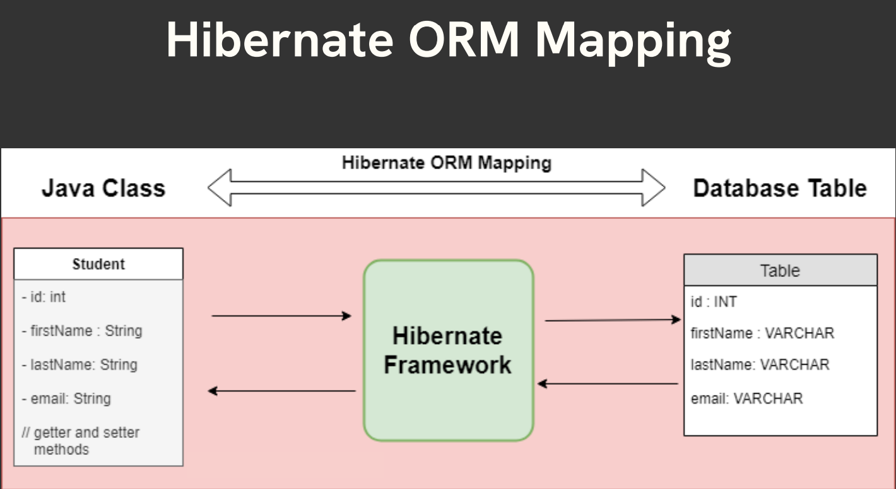
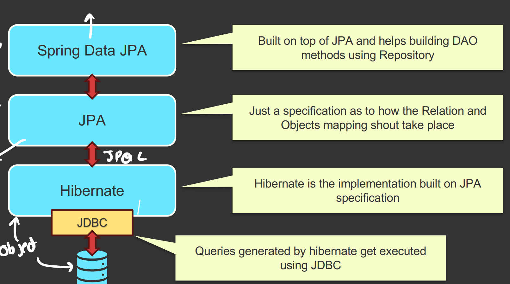

## Hibernate

Hibernate is a powerful, high-performance Object-Relational Mapping
(ORM) framework that is widely used with Java. It provides a framework
for mapping an object-oriented domain model to a relational database.

Hibernate is one of the implementations of the Java Persistence API
(JPA), which is a standard specification for ORM in Java.

## JPA (Java Persistence API)

JPA is a specification for object-relational mapping (ORM) in Java.

It defines a set of interfaces and annotations for mapping Java
objects to database tables and vice versa.

JPA itself is just a set of guidelines and does not provide any
implementation. The implementation of JPA is provided by ORM
frameworks such as Hibernate, EclipseLink, and OpenJPA.

### So Basically…
JPA Provides a standard for ORM in Java applications, ensuring that
developers can switch between different JPA providers without changing
their code.  

And

Hibernate is one such JPA Provider.

However,

Hibernate is a specific implementation of JPA and a powerful ORM
framework on its own. It offers additional features and optimizations
beyond the JPA specification, making it a popular choice for ORM in
Java applications.

## Common Hibernate Configurations
Hibernate needs some settings to work with the database.
Usually written in application.properties (Spring Boot) or hibernate.cfg.xml (core Hibernate).

Example (Spring Boot way):

```properties
spring.datasource.url=jdbc:mysql://localhost:3306/mydb
spring.datasource.username=root
spring.datasource.password=1234
spring.jpa.hibernate.ddl-auto=update/create/validate/createdrop/none
spring.jpa.show-sql=true
spring.jpa.properties.hibernate.format_sql=true
spring.jpa.properties.hibernate.dialect=org.hibernate.dialect.MySQL
   5Dialect (Optional)
```
- hibernate.dialect → tells Hibernate which SQL flavor to use (MySQL, Oracle, Postgres, etc).

- ddl-auto → controls table creation:

  - create → drops old and creates new tables every time.
  - update → updates schema (recommended for dev).
  - validate → only checks schema, doesn’t change.
  - none → no action.

## Entity Annotation
`Marks a Java class as a JPA entity (i.e., it maps to a DB table).`

`Without @Entity, Hibernate ignores the class.`
- @Entity
- @Table
- @Id
- @GeneratedValue(strategy = GenerationType.IDENTITY)
- @Column(name = "name", nullable = false, length = 50)
- @CreationTimestamp and @UpdateTimestamp
- Enumerated
```java
  public enum Gender {
    MALE,
    FEMALE,
    OTHER;
  }
  
    @Enumerated(EnumType.STRING)                // store values like "MALE", "FEMALE"
    @Column(nullable = false, length = 10)
    private Gender gender;
```

#### Table Annotation
```java
@Table(
    name = "employees",
    catalog = "employee_catalog",
    schema = "hr",
    uniqueConstraints = {
            @UniqueConstraint(name = 'email_unique',columnNames = {"email"}),
            @UniqueConstraint(name = 'email_unique',columnNames = {"email"}),
    },
    indexes = {
        @Index(name = "idx_name", columnList = "name"),
        @Index(name = "idx_department", columnList = "department")
    }
)
```

### Key features of JPA
1. Entity Management: Defines how entities (Java objects) are
   persisted to the database.
2. Query Language: Provides JPQL (Java Persistence Query Language) for
   querying entities.
3. Transactions: Manages transactions, making it easier to handle
   database operations within a transactional context.
4. Entity Relationships: Supports defining relationships between
   entities (e.g., One-to-One, One-to-Many, Many-to-One, Many-toMany).

## Spring Data JPA & Dynamic Query Methods

####  1. What is Spring Data JPA?
Spring Data JPA is a part of the Spring framework that makes it easy to interact with relational databases using JPA (Java Persistence API).

👉 Instead of writing boilerplate SQL queries or EntityManager code, you just define repository interfaces and Spring generates queries for you.

Example:
```java
public interface UserRepository extends JpaRepository<User, Long> {
    List<User> findByLastName(String lastName);
}

```
Here, Spring generates the query:
```sql
SELECT * FROM user WHERE last_name = ?;
```
#### Key features of Spring Data JPA
1. Repository Abstraction: Provides a Repository interface with
   methods for common data access operations.
2. Custom Query Methods: Allows defining custom query methods by
   simply declaring method names.
3. Pagination and Sorting: Offers built-in support for pagination and
   sorting.
4. Query Derivation: Automatically generates queries from method
   names.
### 1.  Dynamic Query Methods

#### Rules for Creating Query Methods
   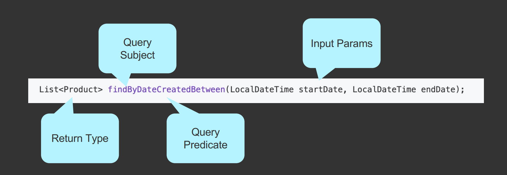
   
#### Rules for Method Names
1. The name of our query method must start with one of the following
   prefixes: find...By, read...By, query...By, and get...By.
   Examples: findByName, readByName, queryByName, getByName
2. If we want to limit the number of returned query results, we can
   add the First or the Top keyword before the first By word.
   Examples: findFirstByName, readFirst2ByName, findTop10ByName
#### Rules for Method Names
1. If we want to select unique results, we have to add the Distinct
   keyword before the first By word.
   Examples: findDistinctByName or findNameDistinctBy
2. Combine property expression with AND and OR.
   Examples: findByNameOrDescription, findByNameAndDescription
3. Checkout the Official Doc for more info:

```java
// Find users by first name
List<User> findByFirstName(String firstName);

// Find users by first name and last name
List<User> findByFirstNameAndLastName(String firstName, String lastName);

// Find users with age greater than
List<User> findByAgeGreaterThan(int age);

// Find users whose name contains a keyword
List<User> findByFirstNameContaining(String keyword);

```
   https://docs.spring.io/spring-data/jpa/reference/repositories/query-keywords-reference.html

### 2 @Query Annotation
When you need more control, you can write JPQL or native SQL queries.

Example with JPQL:
```java
@Query("SELECT u FROM User u WHERE u.email = :email")
User findByEmail(@Param("email") String email);
```
Example with Native SQL:
```java
@Query(value = "SELECT * FROM users u WHERE u.email = :email", nativeQuery = true)
User findByEmailNative(@Param("email") String email);

@Query("SELECT e FROM Employee e WHERE e.name LIKE CONCAT('%', :name, '%') OR e.email LIKE CONCAT('%', :email, '%')")
List<Employee>rishabh(@Param("name") String name, @Param("email") String email);
```
## Sorting and Pagination in Spring Data Jpa

### Sorting 
#### 1. Sorting with method queries
- OrderBy
```java
@Repository
public interface EmployeeRepository extends JpaRepository<Employee,
Long> {
List<Employee> findAllByOrderByNameAsc();
List<Employee> findAllByOrderByNameDesc();
}
```
#### 2. Sorting with the Sort class
Sort Parameter In Query Methods
```java
@Repository
public interface EmployeeRepository extends JpaRepository<Employee,
Long> {
List<Employee> findByDepartment(String department, Sort sort);
}
//Using the Sort class
Sort sort = Sort.by(Sort.Direction.ASC, sortField);
Sort sort = Sort.by(Sort.Order.asc("name"), Sort.Order.desc("salary"));
```

## Pagination
### Key Concepts of Pagination
- Page: A single chunk of data that contains a subset of the total
dataset. It is an interface representing a page of data, including
information about the total number of pages, total number of
elements, and the current page's data.
- Pageable: An interface that provides pagination information such as
page number, page size, and sorting options.
- PageRequest: A concrete implementation of Pageable that provides
methods to create pagination and sorting information.
### Using Pageable
```java
Pageable emppagenumber = PageRequest.of(0,10,Sort.by(Sort.Order.asc("employeeId")));
List<Employee> obj = employeeRepository.findAll(emppagenumber).stream().toList();
```
```java
public interface UserRepository extends JpaRepository<User, Long> {
Page<User> findAll(Pageable pageable);
Page<User> findByLastName(String lastName, Pageable pageable);
}
//Creating Pageable instance:
Pageable pageable = PageRequest.of(pageNumber, size,
Sort.by("lastName").ascending());
```
## Projection in Spring Data JPA
👉 Projection means selecting only specific columns (fields) from an entity instead of fetching the whole entity.

This is useful when you don’t need all data (to save memory, bandwidth, improve performance).
### 1. Default (Entity) Fetch 

Normally, when you call findAll(), JPA selects all columns of the table:
```java
List<Employee> employees = employeeRepository.findAll();
```
Generated SQL:
```java
SELECT employee_id, name, email, salary FROM employee;
```
You get full Employee objects.
### 2. Interface-based Projection
You define an interface with getters only for required fields.
```java
public interface EmployeeNameEmailProjection {
    String getName();
    String getEmail();
}
```
Repository:
```java
public interface EmployeeRepository extends JpaRepository<Employee, Long> {
    List<EmployeeNameEmailProjection> findBy();
}
```
Usage:
```java
List<EmployeeNameEmailProjection> employees = employeeRepository.findBy();
for (EmployeeNameEmailProjection e : employees) {
    System.out.println(e.getName() + " - " + e.getEmail());
}
```
SQL Generated:
```java
SELECT name, email FROM employee;
```
✅ Only name and email fetched, not salary.
### 3. Class-based (DTO) Projection
You can map directly to a custom DTO.
```java
public class EmployeeDTO {
    private String name;
    private String email;

    public EmployeeDTO(String name, String email) {
        this.name = name;
        this.email = email;
    }
    // getters
}
```
Repository:
```java
@Query("SELECT new com.example.EmployeeDTO(e.name, e.email) FROM Employee e")
List<EmployeeDTO> findEmployeeNameAndEmail();
```
Usage:
```java
List<EmployeeDTO> employees = employeeRepository.findEmployeeNameAndEmail();
```
### 4. Dynamic Projection
You can decide projection type at runtime.
```java
<T> List<T> findBy(Class<T> type);
```
Usage:
```java
List<EmployeeNameEmailProjection> projection = employeeRepository.findBy(EmployeeNameEmailProjection.class);
List<EmployeeDTO> dto = employeeRepository.findBy(EmployeeDTO.class);
```
⚡ Why use Projections?
- Reduce unnecessary data fetching.
- Improve performance (less data from DB).
- Return lightweight objects instead of full entities.

## 🔄 Hibernate Entity Lifecycle States
- ***EntityManager***  is the low-level JPA runtime API that manages entity state, queries, flush, transaction boundaries, first-level cache, etc.
- ***JpaRepository<T,ID>*** is a Spring Data interface you use in your code to avoid boilerplate (CRUD, paging, derived queries).
- ***SimpleJpaRepository*** is Spring Data’s default runtime implementation of JpaRepository. It wraps an EntityManager and delegates the actual work to it.


Hibernate defines 4 main entity states (lifecycle stages) while working with the database:
1. Transient State
2. Persistent State
3. Detached State
4. Removed State

### 1. Transient State
- When: You create a new object using new keyword.
- Not associated with Hibernate session.
- Not saved in DB.
- Hibernate doesn’t track it.

Example:

```groovy
Patient p = new Patient(); // Transient
p.setName("Rishabh");
```
- If app crashes → object is gone.
## 2. Persistent State
- When: Object is saved in DB and attached to Hibernate Session (Persistence Context).
- Any change you make → Hibernate detects (dirty checking) and updates DB at flush/commit.
- Example
```groovy
Session session = sessionFactory.openSession();
session.beginTransaction();

Patient p = new Patient();
p.setName("Rishabh");
session.save(p); // Persistent
```
- Now if you do:

```groovy 
p.setName("Nayra"); 
```
→ Hibernate will auto-update DB when transaction commits.
# 3. Detached State
- When: Object was persistent but session is closed OR object is evicted.
- Not tracked anymore.
- Entity was persistent, but now the persistence context is closed or entity is manually detached.
- Hibernate no longer tracks it. Changes won’t go to DB unless you merge().
- Example:
```text
em.close();  // p becomes Detached
e.setName("Changed"); // DB won’t update automatically
em.merge(e); // Reattach, now changes will persist
```

## 4. Removed State
- Entity is marked for deletion from DB.
- Still tracked until flush/commit, then Hibernate issues DELETE.
- Example:
```groovy
em.remove(e); // e is in Removed state
```
- After commit → DB record deleted.

### 🔁 State Transitions (Simple Diagram)
```
new (Transient)
│ persist()
▼
Persistent ── remove() ──► Removed
│ detach() / clear() / close()
▼
Detached ── merge() ──► Persistent
```
👉 So in one line:
The persistence context is like Hibernate’s "memory box" of entities. If an entity is inside it (persistent), Hibernate tracks and syncs changes automatically.

## 📌 Summary (states)
- persist() → makes new object → persistent.
- merge() → copies state of a detached object into a new persistent object.
- remove() → marks entity as deleted.
- flush() → forces Hibernate to sync changes with DB now.
- commit() → flushes automatically + commits the transaction.
- Dirty checking → if you change a managed entity, Hibernate auto-detects and updates DB.
- Detached objects → changes are ignored until reattached with merge()

## 🔗 Relationships in JPA
In a relational database, entities are linked using foreign keys.
In JPA we model these with annotations:
- @OneToOne
- @OneToMany
- @ManyToOne
- @ManyToMany
### 1. One-to-One
👉 One row in Table A relates to one row in Table B.

Example: Employee ↔ Address


### 🏷️ Owning Side vs Inverse Side
- Owning side → the entity that has the foreign key column in DB.
- Inverse side (mappedBy) → just mirrors the relationship; no FK column
#### 👉 In the example above:
- Employee.department = Owning side (it has @JoinColumn).
- Department.employees = Inverse side (mappedBy = "department").

⚠️ Rule: Only owning side updates the database relationship.

Updating inverse side alone does nothing unless you also set the owning side.
### Example of syncing both sides
```groovy
Department d = new Department();
d.setName("IT");

Employee e = new Employee();
e.setName("Amit");
e.setDepartment(d);       // owning side

d.getEmployees().add(e);  // inverse side

em.persist(d);
em.persist(e);

```


## 🔄 Cascading in JPA and @Transactional

- @Transactional wraps code in a DB transaction and provides a persistence context (first-level cache).
- Cascade controls what happens to related entities when you call operations (persist/merge/remove) on an entity inside a transaction.
- They work together: cascade defines what to do; @Transactional ensures the DB changes get committed (or rolled back) as one unit.

- Cascade tells Hibernate what to do with child entities when the parent changes.
- Options:
  - CascadeType.PERSIST → saving parent also saves child.
  - CascadeType.MERGE → merging parent also merges child.
  - CascadeType.REMOVE → removing parent also removes child.
  - CascadeType.ALL → applies all above.
  - orphanRemoval = true → if a child is removed from parent collection, it’s deleted from DB.
#### Example with Cascade
```groovy
@Entity
public class Department {
    @Id @GeneratedValue
    private Long id;
    private String name;

    @OneToMany(mappedBy = "department", cascade = CascadeType.ALL, orphanRemoval = true)
    private List<Employee> employees = new ArrayList<>();
}
```
Now:
```groovy
Department d = new Department();
Employee e = new Employee();
e.setDepartment(d);

d.getEmployees().add(e);

em.persist(d); // will also persist e automatically because of cascade
```
## 🔁  Infinite Loop Problem (Serialization)
When you return JPA entities (like via REST API with Jackson), bidirectional relationships can cause an infinite loop:
- Department → Employee → Department → Employee → …

This happens because JSON serializer keeps traversing both sides.

### ✅ Solutions
1) Jackson annotations
```java
@Entity
public class Department {
    @OneToMany(mappedBy = "department")
    @JsonManagedReference   // forward side
    private List<Employee> employees = new ArrayList<>();
}

@Entity
public class Employee {
    @ManyToOne
    @JsonBackReference      // back side
    private Department department;
}
```
- @JsonManagedReference → serialized normally.
- @JsonBackReference → ignored to stop recursion
2. Use @JsonIgnore
```java
@ManyToOne
@JsonIgnore
private Department department;
```
3) Use DTOs (Recommended for APIs)

Instead of exposing entities directly, map them to DTOs (Data Transfer Objects) and only include fields you need

### ✅ Quick Recap
- Owning side = side with FK + updates DB (@JoinColumn).
- Inverse side = side with mappedBy = just for reading.
- Cascade = parent actions automatically apply to children.
- Infinite loop fix = use `@JsonManagedReference/@JsonBackReference`, or `@JsonIgnore`, or` DTOs`

### N+1 problem in JPA — what it is, why it happens, and how to fix it
Short version: the N+1 problem happens when loading a collection or related entity causes one query to load the root entities and then N additional queries — one per row — to load the related data. That turns a single logical fetch into many SQL queries and kills performance.

Concrete example (typical)

Entities:
```groovy
@Entity
public class Author {
    @Id Long id;
    String name;
    @OneToMany(mappedBy = "author", fetch = FetchType.LAZY)
    List<Book> books;
}

@Entity
public class Book {
    @Id Long id;
    String title;
    @ManyToOne(fetch = FetchType.LAZY)
    Author author;
}

```
Repository code:
```groovy
List<Author> authors = authorRepository.findAll(); // returns 10 authors

for (Author a : authors) {
    System.out.println(a.getBooks().size()); // access LAZY collection
}
```
What Hibernate will typically do (SQL):
1. SELECT * FROM author; — 1 query (N = number of authors = 10)
2. For each author when getBooks() is accessed:
   - SELECT * FROM book WHERE author_id = ?; — 10 queries (one per author)

Total = 1 + N queries = 11 queries. As N grows, cost grows linearly.

### Why it happens
- JPA FetchType.LAZY will not load associations initially.
- When you access the association, JPA issues a separate query per association instance to fetch the data.
- Default mapping + accessing child collections in a loop is the common trigger
### Fixes / Alternatives (with examples)
1) JOIN FETCH to load in a single query
```groovy
@Query("SELECT a FROM Author a JOIN FETCH a.books")
List<Author> findAllWithBooks();
```
This will produce a single SQL with a join fetching authors and books. Good for small result sets.

Caveat: JOIN FETCH can produce duplicates at the entity level (use distinct in JPQL) and complicate paging.


## Making Third party API CALLS WITH RestClient

### RestClient
The RestClient is a synchronous HTTP client that offers a modern,
fluent API. It offers an abstraction over HTTP libraries that allows
for convenient conversion from a Java object to an HTTP request, and
the creation of objects from an HTTP response.

### Building RestClient
```java
RestClient restClient = RestClient.builder()
.baseUrl(BASE_URL)
.defaultHeader(HttpHeaders.AUTHORIZATION,
encodeBasic(properties.getUsername(),properties.getPassword())
)
.build();
```

### Using the RestClient
```java
CustomerResponse customer = restClient.get()
.uri("/{id}",3)
.accept(MediaType.APPLICATION_JSON)
.retrieve()
.body(CustomerResponse.class);
```
- Apart from get(), we have post(), put(), patch() and delete() methods as well.

one more example 
```java
@Configuration
public class RestClientConfig {

//    @Value("${employeeService.base.url}")
    private String BASE_URL="http://localhost:8080";

    @Bean
    @Qualifier("employeeRestClient")
    RestClient getEeployeeServiceRestClient()
    {
        return RestClient.builder()
                .baseUrl(BASE_URL)
                .defaultHeader(CONTENT_TYPE,APPLICATION_JSON_VALUE)
                .build();
    }
}
```
```java
    @Override
    public ApiResponse<StudentDTO> addStudent(StudentInputDTO studentInputDTO) {
        ApiResponse<StudentDTO> newstudent = restClient.post()
                .uri("/student")
                .body(studentInputDTO)
                .retrieve()
                .body(new ParameterizedTypeReference<ApiResponse<StudentDTO>>() {
                });
        return newstudent;
    }
```

### Handling Errors in RestClient
```java
ResponseEntity response = restClient.delete()
....
.onStatus(HttpStatusCode::is4xxClientError,
(req, res) ->
logger.error("Couldn't delete "+res.getStatusText())
)
.toBodilessEntity();
```


## Logging
Logging is the process of tracking all the events that happen after a
piece of code is run. It is a very important aspect of software
development as it helps to track where exactly the code crashes and
thus eases debugging.

A logging framework can be used to perform all the tasks like setting
log file destinations, customizing log messages , etc.

### SLF4J
To make logging easier for programmers, Java provides a variety of
logging frameworks like : log4J, java.util.logging (JUL), tiny log,
logback, etc.

Spring Boot comes with SLF4J inbuilt, which is an abstraction of all
these logging frameworks. SLF4J stands for Simple Logging Façade for
Java. It allows users to work with any of the logging frameworks with
a single dependency.

### Elements of Logging Framework

Every logging framework comes with three elements.

1. Logger — capture the messages
2. Formatter — formats the messages captured by the logger
3. Handler — Dispatches the messages by printing them on the console ,
   or storing them in a file , sending an email, etc.

###  Log Levels
The messages logged can be of various security levels . Spring Boot
supports five log levels which are
1. FATAL – fatal error crashing the system
2. ERROR — runtime errors
3. WARN — warning
4. INFO — events occurring at the run time
5. DEBUG — Information about the flow of the system
6. TRACE — more detailed information about the flow of the system

Example
```java
import org.slf4j.Logger;
import org.slf4j.LoggerFactory;

@RequestMapping("/student")
@RequiredArgsConstructor
public class StudentController {
    private final StudentService studentService;
    Logger log = LoggerFactory.getLogger(StudentController.class); // returns an SLF4J Logger instance tied to the provided class name (usually the fully-qualified class name).returns an SLF4J Logger instance tied to the provided class name (usually the fully-qualified class name).

    @GetMapping
    public List<StudentOutputDTO> getAllStudent() {
        log.warn("Warn message");
        log.info("info message");
        log.debug("debug message");

        return studentService.getAllStudent();
    }
}
```
### Setting Log Levels
When you enable a level, Log4j logs these
events at that level and all levels above it.
For example, enabling WARN events will show
WARN through FATAL events, but not INFO
through TRACE.

logging.level.root=INFO
logging.level.com.myPackageName =DEBUG
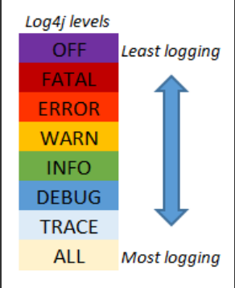

Logging levels & when to use them

- Ordered (highest → lowest severity): ERROR > WARN > INFO > DEBUG > TRACE.
- ERROR: fatal errors, exceptions that prevent normal flow.
- WARN: something suspicious that may need attention but isn't fatal.
- INFO: high-level runtime events (startup, major actions). Good for production logs.
- DEBUG: detailed diagnostic data for developers (enable in dev or troubleshooting).
- TRACE: extremely fine-grained, usually too verbose for normal use.

you can also configure Logback with logback-spring.xml for more advanced control
```xml
logging:
  level:
    com.example.Week1Introduction.Week_1_.Introduction.student.StudentController: DEBUG
```
### Log Formatters
The log messages can be formatted and customized according to our
requirements by setting colors , message format , etc.

logging.pattern.console= %d [%level] %c{1.} [%t] %m%n

- %d — date
- % level — log level
- %c — class path
- %t — thread executing
- %m — message
- %n — new line


# 🛡️ Spring Security

## Security Attacks

### Cross-Site Request Forgery (CSRF)
- Cross-Site Request Forgery (CSRF) is an attack that tricks a user into
performing actions on a web application in which they are
authenticated, without their consent. This is achieved by exploiting
the web application's trust in the user's browser.
- For example, if a banking site doesn't protect against CSRF, an
attacker could trick a logged-in user into making a bank transfer
without their knowledge.
- How to avoid
    1. Maintain user session on server with the xcsrf token. This token
               should be very unpredictable.
    2. Go STATELESS and manage authentication with the JWT token.


### Adding Spring Security
In a Spring boot application, we only need to include the spring-bootstarter-security dependency and Spring boot auto-configured the
security with sensible defaults defined in WebSecurityConfiguration
class.
```java
<dependency>
<groupId>org.springframework.boot</groupId>
<artifactId>spring-boot-starter-security</artifactId>
</dependency>
```
### Authentication and Authorization
Authentication is the process of verifying the identity of a user. It ensures that the user is
who they claim to be. Authentication typically involves validating credentials, such as a
username and password, and creating a security context for the user

Authorization is the process of determining whether an authenticated user has the
necessary permissions to access a particular resource or perform an action. It controls
what an authenticated user can or cannot do.

### Internal working of Spring Security

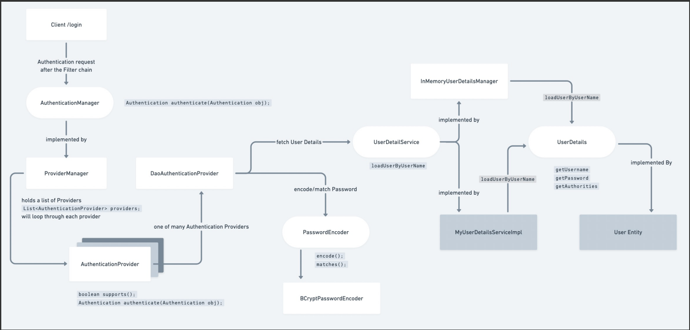

- In a Spring Boot application,
  SecurityFilterAutoConfiguration
  automatically registers the
  DelegatingFilterProxy filter with the name 
  springSecurityFilterChain.
- Once the request reaches to
  DelegatingFilterProxy, Spring delegates the
  processing to FilterChainProxy bean that
  utilizes the SecurityFilterChain to execute
  the list of all filters to be invoked for the
  current request.
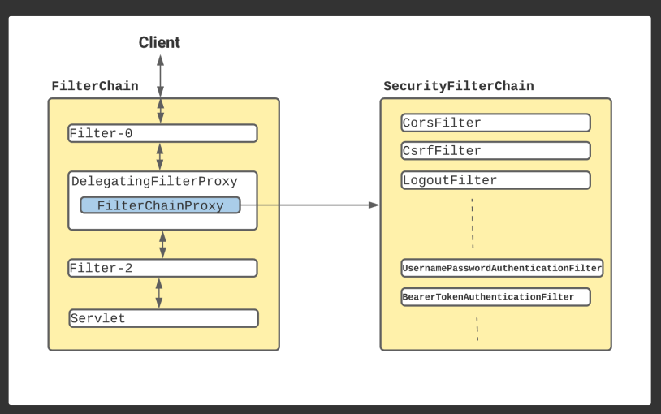

### Default behaviour of Spring Security
- Creates a bean named springSecurityFilterChain. Registers the Filter with a bean
named springSecurityFilterChain with the Servlet container for every request.
- HTTP basic authentication for authenticating requests made with remoting protocols and
web services.
- Generate a default login form.
- Creates a user with a username of user and a password that is logged to the console.
- Protects the password storage with BCrypt.
- Enables logout feature.
- Other features such as protection from CSRF attacks and session fixation

### Core Spring Security Components
1. **UserDetails** : 

   - The UserDetails interface represents a user in the Spring Security framework.
      It provides methods to get user information such as username, password, and authorities.
   - Purpose: To encapsulate user information, including authentication and authorization details.
   - Implementation: You can use it to extend your User Entity.
2. **UserDetailsService**
   - The UserDetailsService interface is a core component in Spring Security that is used to
         retrieve user-related data. It has a single method: loadUserByUsername
   - Purpose: To fetch user details from a datasource (e.g., database) based on the username.
   - Implementation: You typically implement this interface to load user details, such as username, password, and roles, from your own user repository.
3. **InMemoryUserDetailsManager**
      - The InMemoryUserDetailsManager is a Spring Security provided implementation of
      UserDetailsService that stores user information in memory.
      - Purpose: To store user details in memory, typically for testing or small applications.
      You define users directly in the configuration.
4. **PasswordEncoder**
   - The PasswordEncoder interface is used for encoding and validating passwords. It has methods
   for encoding raw passwords and matching encoded passwords.
   - Purpose: To securely hash passwords before storing them and to verify hashed passwords
   during authentication.
   - Common Implementations:
     - BCryptPasswordEncoder
     - Pbkdf2PasswordEncoder
     - SCryptPasswordEncoder

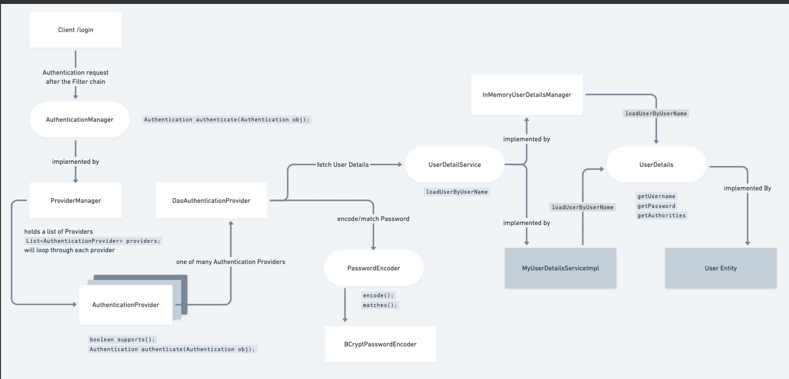

## ⭐ SPRING SECURITY FULL FLOW
### 1️⃣ When a request comes to the server
#### Step 1 → Request enters Servlet Filter Chain
- Every HTTP request first goes into Java Servlet Filters.
- One of these filters is:
  - DelegatingFilterProxy → FilterChainProxy`
- FilterChainProxy now calls Spring Security Filter Chain.
```groovy
Note
The SecurityFilterChain is based on the Chain of Responsibility design pattern.
Every filter decides:
    Should I authenticate?
    Should I skip?
    Should I throw an error?
    Should I pass to the next filter?
```
### 2️⃣ Spring Security Filter Chain begins
Spring Security creates a chain of filters like:

The default SecurityFilterChain includes many filters.

Here are the important ones:

- WebAsyncManagerIntegrationFilter
- SecurityContextPersistenceFilter
- HeaderWriterFilter
- CorsFilter (if configured)
- CsrfFilter
- LogoutFilter
- UsernamePasswordAuthenticationFilter
- DefaultLoginPageGeneratingFilter
- BasicAuthenticationFilter
- RequestCacheAwareFilter
- SecurityContextHolderAwareRequestFilter
- AnonymousAuthenticationFilter
- SessionManagementFilter
- ExceptionTranslationFilter
- FilterSecurityInterceptor ← authorization check

These filters run in fixed order.
```groovy
Note
2️⃣ Every filter checks SecurityContext FIRST
This is VERY important:
    👉 Before doing any authentication, every filter checks:

            SecurityContextHolder.getContext().getAuthentication()

If authentication is already present:
    - Filter skips authentication
    - Request continues
This prevents duplicate authentication.
```
### 3️⃣ Authentication happens inside the filter chain
- 3.1 If JWT request
  - Your custom JWT filter (extends OncePerRequestFilter) runs.
  - Flow inside JWT Filter:
    - Read Authorization: Bearer token
    - Validate token
    - Extract username
    - Call UserDetailsService.loadUserByUsername()
    - Create Authentication object
    - Put it inside SecurityContext
  - 👉 If the user is authenticated → SecurityContext is filled → Next filters do NOT authenticate again.

- 3.2 If Form Login request
  - This uses:
  - UsernamePasswordAuthenticationFilter
  - Flow:
    - Reads username + password from request
    - Creates a UsernamePasswordAuthenticationToken
    - Passes it to AuthenticationManager.authenticate()

```groovy
Note
3️⃣ JWT filters must run BEFORE UsernamePasswordAuthenticationFilter
Reason:
    JWT requests do not send username/password.
    If JWT filter doesn’t run before, Spring might try form-login authentication.
That’s why we always configure:

http.addFilterBefore(jwtFilter, UsernamePasswordAuthenticationFilter.class);
```
### 4️⃣ AuthenticationManager (CORE)
- AuthenticationManager → interface
- Most used implementation → ProviderManager
- ProviderManager has a list:
- ``` List<AuthenticationProvider> providers```
- It loops through each provider.
```groovy
Note
4️⃣ AuthenticationManager NEVER does real authentication
Many people think AuthenticationManager authenticates — it DOES NOT.
AuthenticationManager delegates authentication to AuthenticationProviders.
Actual authentication is done inside:
    DaoAuthenticationProvider
    JwtAuthenticationProvider (if custom)
    LdapAuthenticationProvider
    etc.
```
### 5️⃣ AuthenticationProvider (DECIDES AUTH)
- Example provider:
- DaoAuthenticationProvider
  - Calls UserDetailsService.loadUserByUsername()
  - Gets UserDetails
  - Uses PasswordEncoder.matches() to check password
  - If valid → returns an Authentication object

```groovy
Note
5️⃣ UserDetailsService is used ONLY during Authentication
        UserDetailsService is NOT used during authorization
        It is only used to load user data during login or JWT validation.
```
### 6️⃣ UserDetailsService
Your implementation:
```groovy
MyUserDetailsServiceImpl implements UserDetailsService
```
Method:
```groovy
UserDetails loadUserByUsername(String username)
```
Returns a UserDetails object (contains username, password, authorities)

Note
```groovy
Note
6️⃣ SecurityContext uses ThreadLocal
SecurityContextHolder stores Authentication using ThreadLocal.
        Meaning:
            Each request thread gets its own SecurityContext
            When request completes, SecurityContext is cleared
```
### 7️⃣ PasswordEncoder
- Responsible for:
  - encode(password)
  - matches(rawPassword, encodedPassword)
- Most used: BCryptPasswordEncoder
```groovy
Note
7️⃣ Difference between Authentication and Authorization
Authentication = Who are you? 
        Username, password, token verification
        Done by filters + provider
Authorization = What can you access?
        Role + URL access check
        Done by FilterSecurityInterceptor
```

### 8️⃣ After authentication → SecurityContext is filled
```groovy
SecurityContextHolder.getContext().setAuthentication(authObj)
```
Now the user is considered logged in.
```text
Note
8️⃣ FilterSecurityInterceptor uses AccessDecisionManager
Important internal component:
    When FilterSecurityInterceptor needs to check a URL
    It delegates to AccessDecisionManager
AccessDecisionManager uses voters like: 
    RoleVoter
    AuthenticatedVoter
These voters decide allow or deny.
```
### 9️⃣ Authorization (URL access check)
- This is done by:
- ⭐ FilterSecurityInterceptor
- It checks your rules from:
```text
http.authorizeHttpRequests()
```
- This filter verifies:
  - Does the user have required ROLE?
  - If not → returns 403 Forbidden.
```groovy
Request Flow: 
Servlet Filters →  DelegatingFilterProxy → FilterChainProxy → Spring Security Filters → (JWT / UsernamePassword filters) →
AuthenticationManager → ProviderManager → AuthenticationProvider →
UserDetailsService + PasswordEncoder → Authentication Success → SecurityContext →
FilterSecurityInterceptor (Authorization) → Controller

```

### Default SecurityFilterChain Config

-  authorizeRequests() restricts access based on RequestMatcher implementations.
-  authenticated() requires that all endpoints called be authenticated before proceeding in the
filter chain.
-  formLogin() calls the default FormLoginConfigurer class that loads the login page to
authenticate via username-password and accordingly redirects to corresponding failure or
success handlers.
-  csrf() to cofigure the csrf protection
```groovy
@Bean
SecurityFilterChain securityConfig(HttpSecurity http) throws Exception {

    http
        .csrf(csrf -> csrf.disable())                  // Disable CSRF for JWT
        .cors(cors -> {})                              // Enable CORS
        .sessionManagement(sess ->
            sess.sessionCreationPolicy(SessionCreationPolicy.STATELESS)) // No session for JWT
        .authorizeHttpRequests(auth -> auth
            .requestMatchers("/auth/**").permitAll()   // Public URLs
            .requestMatchers("/admin/**").hasRole("ADMIN")
            .requestMatchers("/user/**").hasAnyRole("USER", "ADMIN")
            .anyRequest().authenticated()              // Everything else must be authenticated
        )
        .authenticationProvider(authenticationProvider) // Dao/Auth provider
        .addFilterBefore(jwtFilter, UsernamePasswordAuthenticationFilter.class); // Custom JWT filter

    return http.build();
}

```

### Understanding JWT

#### Why use JSON Web Token (JWT)
1. Stateless
2. Scalable in Distributed Systems
3. Cross domain authentication
4. Ideal for Decentralized systems and microservices
5. Highly secure

#### JSON Web Token (JWT)

- JWT is a compact, URL-safe means of representing claims to be transferred between two parties.
- JWT is often used to transmit non-sensitive data that doesn't require confidentiality but still needs integrity and authenticity. This includes user identifiers, roles, permissions, and other claims necessary for making access control decisions.
  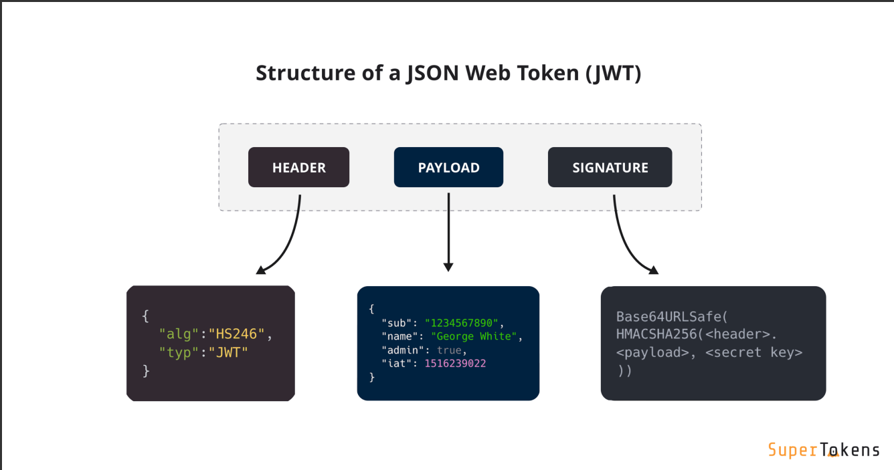
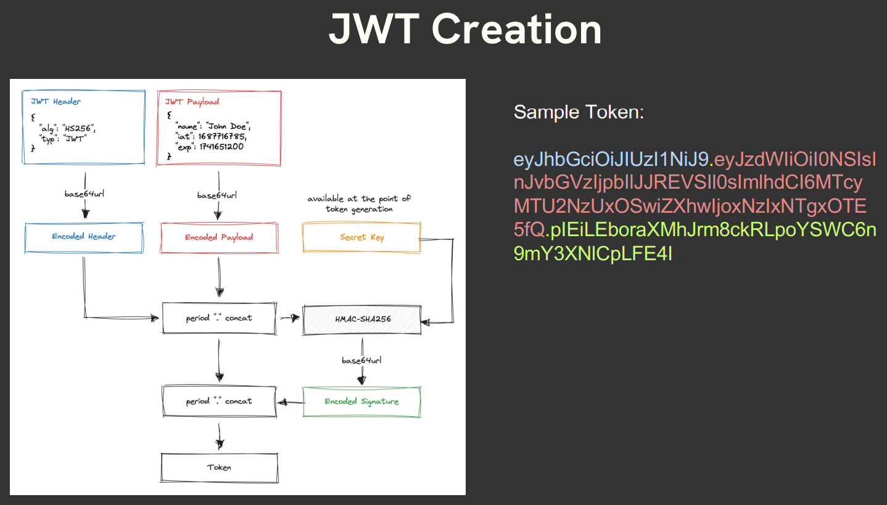
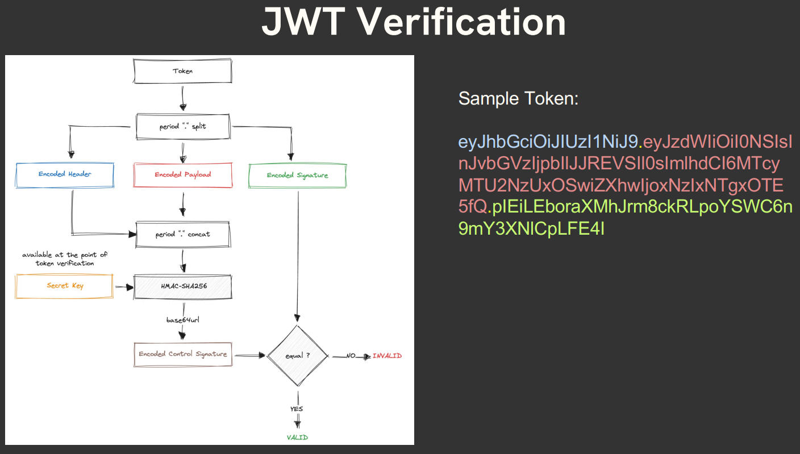


#### JWT Dependencies
```JAWA

<!-- https://mvnrepository.com/artifact/io.jsonwebtoken/jjwt-api -->
<dependency>
    <groupId>io.jsonwebtoken</groupId>
    <artifactId>jjwt-api</artifactId>
    <version>0.12.6</version>
</dependency>

<!-- https://mvnrepository.com/artifact/io.jsonwebtoken/jjwt-impl -->
<dependency>
    <groupId>io.jsonwebtoken</groupId>
    <artifactId>jjwt-impl</artifactId>
    <version>0.12.6</version>
    <scope>runtime</scope>
</dependency>

<!-- https://mvnrepository.com/artifact/io.jsonwebtoken/jjwt-jackson -->
<dependency>
    <groupId>io.jsonwebtoken</groupId>
    <artifactId>jjwt-jackson</artifactId>
    <version>0.12.6</version>
    <scope>runtime</scope>
</dependency>
```
###  Creation and Verification of JWT

***JwtService.java***
```java
@Service
public class JwtService {

    private static final String SECRET_KEY = "mySecretKeyForJwtGeneration123456";

    private Key getSignKey() {
        return Keys.hmacShaKeyFor(SECRET_KEY.getBytes(StandardCharsets.UTF_8));
    }

    // ✅ Create Token
    public String generateToken(QC_EGMS_USERS user)
    {
        return Jwts.builder()
                .subject(user.getUsername())
                .claim("firstName",user.getFirstName())
                .claim("roles", Set.of("ADMIN","USER"))
                .issuedAt(new Date())
                .expiration(new Date(System.currentTimeMillis()+1000*60*60))
                .signWith(getsecretKey())
                .compact();
    }


    // ✅ Extract Username
    public String extractUsername(String token) {
        return extractClaims(token).getSubject();
    }

    // ✅ Validate Token
    public boolean isTokenValid(String token, UserDetails userDetails) {
        String username = extractUsername(token);
        return username.equals(userDetails.getUsername())
                && !isTokenExpired(token);
    }

    private boolean isTokenExpired(String token) {
        return extractClaims(token).getExpiration().before(new Date());
    }

    private Claims extractClaims(String token) {
        return Jwts.parserBuilder()
                .setSigningKey(getSignKey())
                .build()
                .parseClaimsJws(token)
                .getBody();
    }
}
```
#### create and login 
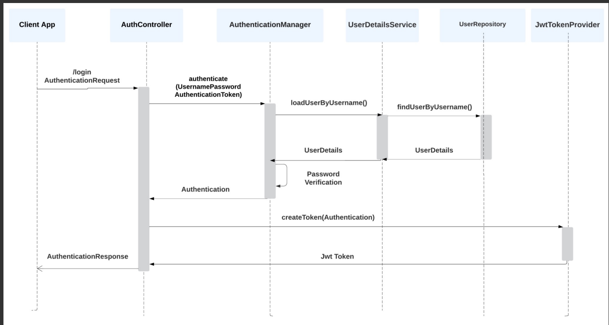

STEP 1 User
```java
@Getter
@Setter
@Entity
public class QC_EGMS_USERS implements UserDetails {
    @Id
    @GeneratedValue(strategy = GenerationType.SEQUENCE)
    private  Long id;
    @Column(unique = true)
    private String email;
    private String password;
    private String firstName;
    private String lastName;
    private String phoneNumber;
    @Column(unique = true,nullable = false)
    private String username;

    public QC_EGMS_USERS() {
        // default constructor required by ModelMapper
    }

    public QC_EGMS_USERS(String email, String password) {
        this.email = email;
        this.password = password;
    }

    @Override
    public Collection<? extends GrantedAuthority> getAuthorities() {
        return List.of();
    }

    @Override
    public String getPassword() {
        return this.password;
    }

    @Override
    public String getUsername() {
        return this.username;
    }
}
```
STEP 2 UserService
```java
@Service
@RequiredArgsConstructor
public class UserService implements UserDetailsService {
    private final UserRepo userRepo;

    @Override
    public UserDetails loadUserByUsername(String username) throws UsernameNotFoundException {
        return userRepo.findByUsername(username).orElseThrow(()-> new RuntimeException("User not found"));
    }
}
```
STEP 3 UserRepo
```java
@Repository
public interface UserRepo extends  JpaRepository<QC_EGMS_USERS,Long> {
    Optional<QC_EGMS_USERS> findByUsername(String user);
}
```
STEP 4 Creation and Verification of JWT

STEP 5 AuthController
```java
@RestController
@RequestMapping("/auth")
@RequiredArgsConstructor
public class AuthController {
    private final AuthService authService;

    @PostMapping("/signup")
    public ResponseEntity<UserDto> signUp(@RequestBody UserDto userDto, HttpServletResponse response)
    {
        System.out.println(userDto.getEmail()+" email");
        System.out.println(userDto.getUsername()+" username");
        return ResponseEntity.ok(authService.signUp(userDto));
    }

    @PostMapping("/login")
    public ResponseEntity<ApiResponse<String>> login(@RequestBody LoginDTO loginDTO,HttpServletResponse response)
    {
        String token = authService.login(loginDTO);
        response.setHeader("Authorization", "Bearer " + token);
        return ResponseEntity.ok(ApiResponse.success(token,"Token is Generated"));
    }
}
```
Step 6 AuthService
```java
@Service
@AllArgsConstructor
public class AuthService {
    private final JwtService jwtService;
    private final AuthenticationManager authenticationManager;
    private final UserRepo userRepo;
    private final ModelMapper modelMapper;
    private final PasswordEncoder passwordEncoder;

    public String login(LoginDTO loginDTO) {
        Authentication authentication = authenticationManager.authenticate(
                new UsernamePasswordAuthenticationToken(loginDTO.getUsername(),loginDTO.getPassword())
        );
        QC_EGMS_USERS users = (QC_EGMS_USERS) authentication.getPrincipal();
        System.out.println(users);
        return jwtService.generateToken(users);
    }

    public UserDto signUp(UserDto userDto)
    {
        Optional<QC_EGMS_USERS> user = userRepo.findByUsername(userDto.getEmail());
        if(user.isPresent())
        {
            throw new RuntimeException("User already Presend");
        }else{
            QC_EGMS_USERS newuser = modelMapper.map(userDto,QC_EGMS_USERS.class);
            newuser.setPassword(passwordEncoder.encode(newuser.getPassword()));
            QC_EGMS_USERS savedUser = userRepo.save(newuser);
            return modelMapper.map(savedUser,UserDto.class);
        }
    }
}
```
### Authenticating requests using JWT
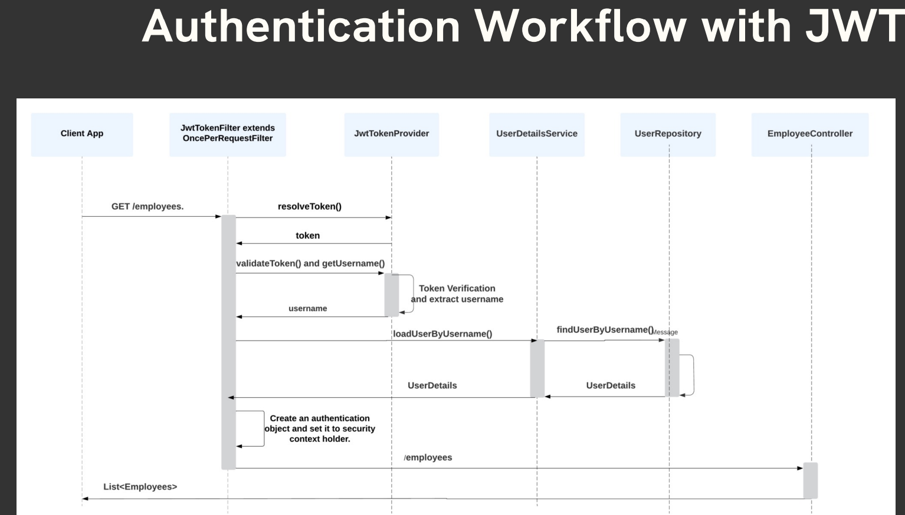
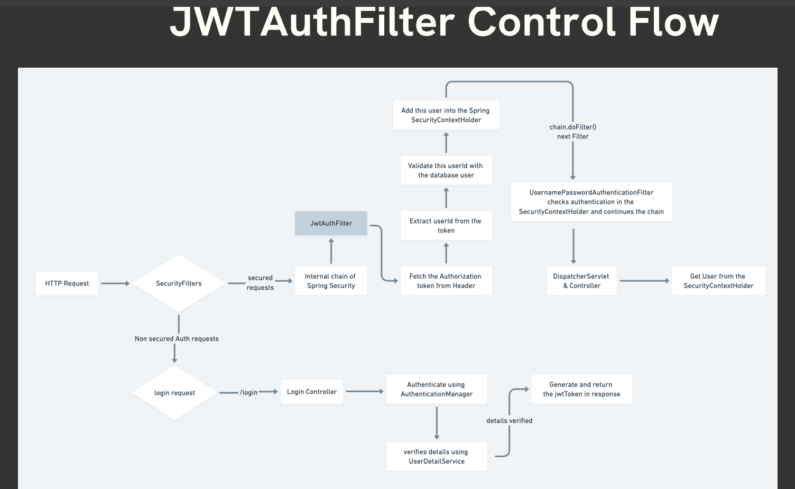


Step 7 JwtFilter
```java
package com.example.Week1Introduction.Week_1_.Introduction.system.JWTAuth;

import com.example.Week1Introduction.Week_1_.Introduction.common.exception.NotFoundError;
import com.example.Week1Introduction.Week_1_.Introduction.system.QC_EGMS_USERS;
import com.example.Week1Introduction.Week_1_.Introduction.system.UserRepo;
import com.example.Week1Introduction.Week_1_.Introduction.system.UserService;
import jakarta.servlet.FilterChain;
import jakarta.servlet.ServletException;
import jakarta.servlet.http.HttpServletRequest;
import jakarta.servlet.http.HttpServletResponse;
import lombok.RequiredArgsConstructor;
import org.springframework.security.authentication.UsernamePasswordAuthenticationToken;
import org.springframework.security.core.context.SecurityContextHolder;
import org.springframework.security.web.authentication.WebAuthenticationDetailsSource;
import org.springframework.stereotype.Component;
import org.springframework.web.filter.OncePerRequestFilter;

import java.io.IOException;
import java.util.Optional;

@RequiredArgsConstructor
@Component
public class JwtFilter extends OncePerRequestFilter {
    private final JwtService jwtService;
    private final UserRepo userRepo;

    @Override
    protected void doFilterInternal(HttpServletRequest request, HttpServletResponse response, FilterChain filterChain) throws ServletException, IOException {
        String authHeader = request.getHeader("Authorization");

        // 1️⃣ No token → continue filter chain
        if (authHeader == null || !authHeader.startsWith("Bearer ")) {
            filterChain.doFilter(request, response);
            return;
        }

        // 2️⃣ Extract token safely
        String token = authHeader.substring(7);

        // 3️⃣ Validate expiration
        if (jwtService.isTokenExpired(token)) {
            response.setStatus(HttpServletResponse.SC_UNAUTHORIZED);
            return;
        }

        // 4️⃣ Skip if already authenticated
        if (SecurityContextHolder.getContext().getAuthentication() != null) {
            filterChain.doFilter(request, response);
            return;
        }

        // 5️⃣ Extract username
        String username = jwtService.extractUsername(token);

        QC_EGMS_USERS user = userRepo.findByUsername(username)
                .orElse(null);
        if (user == null) {
            response.setStatus(HttpServletResponse.SC_UNAUTHORIZED);
            return;
        }
        // 6️⃣ Set authentication
        UsernamePasswordAuthenticationToken authentication =
                new UsernamePasswordAuthenticationToken(
                        user,
                        null,
                        user.getAuthorities()
                );
        authentication.setDetails(
                new WebAuthenticationDetailsSource().buildDetails(request));
        SecurityContextHolder.getContext().setAuthentication(authentication);
        filterChain.doFilter(request, response);
    }
}
```
Step 8 Add Filter to Spring Security filter chain
```java
@Configuration
@EnableWebSecurity
@RequiredArgsConstructor
@Slf4j
public class WebSecurityConfig {
    private final AuthenticationConfiguration authenticationConfiguration;
    private final JwtFilter jwtFilter;

    @Bean
    public AuthenticationManager authenticationManager() throws Exception {
        return authenticationConfiguration.getAuthenticationManager();
    }

    @Bean
    SecurityFilterChain securityFilterChain(HttpSecurity httpSecurity) throws Exception
    {
        log.debug("============================================Sprign Security=================================");
        httpSecurity
                .authorizeHttpRequests(auth -> auth
                        .requestMatchers("/auth/**").permitAll()   // Public URLs
                        .requestMatchers("/admin/**").hasRole("ADMIN")
                        .anyRequest().authenticated())
                .csrf(csrfConfig -> csrfConfig.disable())
                .sessionManagement(sessionConfig->sessionConfig.sessionCreationPolicy(SessionCreationPolicy.STATELESS))
                .addFilterBefore(jwtFilter, UsernamePasswordAuthenticationFilter.class);
        return httpSecurity.build();
    }
}
```


# Understanding Junit and AssertJ

### Common Junit Annotations
- @Test: Marks a method as a test method. JUnit will execute this method when running tests.
- @DisplayName: Sets a custom display name for the test class or test method. This name is used in test reports and IDEs.
- @Disabled: Disables a test class or test method. Disabled tests are not executed.
-  @BeforeEach: Indicates that the annotated method should be executed before each test method. These can be used to reset each test case conditions.
- @AfterEach: Indicates that the annotated method should be executed after each test method.
- @BeforeAll: Indicates that the annotated method should be executed once before all test methods in the class. The method must be static. (Executed once)
- @AfterAll: Indicates that the annotated method should be executed once after all test methods in the class. The method must be static. (Executed once)
### JUnit vs AssertJ
JUnit is one of the most widely used testing frameworks in the Java ecosystem. JUnit
provides a simple and standardized way to write test cases, execute them, and report
the results.

AssertJ, on the other hand, is not a testing framework but rather a library that
complements testing frameworks like JUnit. It focuses on providing fluent and
expressive assertions, enhancing the readability and maintainability of your test code.

JUnit and AssertJ are both popular tools used in Java for testing, but they serve
different purposes and have distinct features. 
### Common AssertJ Methods
1. Numbers: assertThat(5).isEqualTo(5).isNotEqualTo(10).isGreaterThan(4);
2. String: assertThat("hello").startsWith("he").endsWith("lo").contains("ell");
3. Boolean: assertThat(true).isTrue(); OR assertThat(false).isFalse();
4. List/Array: assertThat(List.of("apple", "banana")).contains("apple").doesNotContain("orange").hasSize(2);
5. ```Exceptions:
      assertThatThrownBy(() -> {
      throw new IllegalArgumentException("Invalid argument");
      }).isInstanceOf(IllegalArgumentException.class)
      .hasMessage("Invalid argument")
      .hasStackTraceContaining("ExampleTest");
   ```
6. More AssertJ Methods: https://assertj.github.io/doc/

### Unit Testing vs Integration Testing
1. Unit Tests:
   - A unit test covers a single “unit”, where a unit commonly is a single class, but can also be a cluster of cohesive classes that is tested in combination.
   - Focus: Individual components, such as methods in a service class.
   -  Tools: JUnit, Mockito
   -  Example: Testing a service method that performs a calculation or business logic
2. Integration Tests:
   - A test that covers multiple layers. This might cover the interaction between a business service and the persistence layer, for instance.
   - Focus: Interaction between multiple components, such as repositories, services, and controllers.
   - Tools: Spring Test, @SpringBootTest.
   - Example: Testing the interaction between a service and a repository
### Key Testing Annotations in Spring Boot
- @SpringBootTest: Used to create an application context and load the full application for integration tests. Useful in Integration Testing.
- @DataJpaTest: Used to test JPA repositories, configuring an in-memory database for the test. Useful in Unit Testing Service Layer and Persistence Layer.
- @TestConfiguration: Used to define extra beans or configurations for tests.
- @WebMvcTest: Used for testing Spring MVC controllers. It initializes only the web layer and not the entire context. Useful in Unit Testing Controller layer
- @AutoConfigureTestDatabase: Used to replace the actual database with an embedded database during tests.